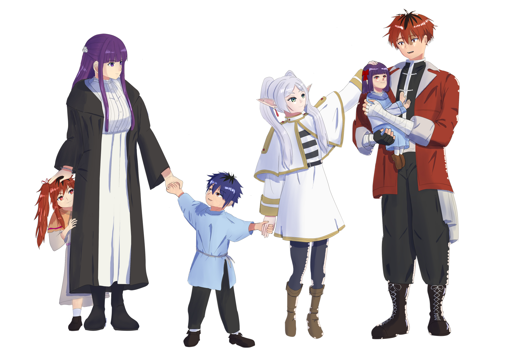

# 春を越えて、願いは実る【完】
## ありふれた当たり前の願い

中央諸国クレ地方街道  

目的地近くまで移動するという馬車と出会い、時間にも余裕があり魔法での移動もそろそろ疲れたと乗せてもらった道中。  
眼前に広がる小麦の畑は収穫の季節の近さを感じさせ、大きな穂を実らせこうべを垂らしさながら金色の絨毯を思わせる。  

「――今年も、たくさん実ったね」  

満足気にそう呟いたフリーレンの独り言を聞いた馬車主はフリーレンに問いかける。  

「お客さんはこの地方の方ですか？」  
「そうだよ。ちょっと仕事で遠くまで出ていたから今はその帰りってところ」  
「なるほど、つまりこれから収穫の作業のお手伝いって訳ですか」  
「まあ、そんなところかな」  

馬車主とそんな会話を交わしつつ揺れる馬車に乗りながら周りを見渡す。  
かつて戦士の村が魔族の襲撃に遭い、滅んだ後は荒れ放題だったこの一帯は今や大きな穀倉地帯となっている。  

この一帯を蘇らせるために奔走し続けたシュタルクとそれを隣で支え続けたフェルン。  
それに協力してくれた多くの人たちの大きな成果だ。  

「……あれからもう15年ぐらい経つんだっけ？」  

<ruby><rb>魂の眠る地 </rb><rt> オレオール</rt></ruby>への旅の終わり。それは今迄一緒にいることが当たり前だったフリーレン一行のその後のあり方を、このパーティーの終わりをシュタルクとフェルンに嫌がおうにも考えさせた。  

あの日、故郷とそこに眠る英霊たちへの救いを願い、旅を辞めて1人ここに残ると決断したシュタルク。  
フリーレンと共にあることとシュタルクのそばにいること、築き上げてきた想いと絆の間で迷い、涙を流したフェルン。  

そして、<ruby><rb>魂の眠る地 </rb><rt> オレオール</rt></ruby>までの旅に寄り添ってくれた2人をずっと見てきたフリーレン。  

――『聞いてフェルン。大事なことだ。フェルンもシュタルクももっと我儘でいいんだよ。我慢しなくていい。欲しい物を全部願っていいんだ』  

泣いているフェルンに自分で言った言葉ではあるが、随分らしくない事を言ってしまったようにも思う。  

――『だからね、頑張ったフェルンとシュタルクの我儘にこれからの数百年付き合うことなんてそんな苦じゃないんだ』  
――『私は私のできる限りでフェルンの望むことを何でもしてあげたい。きっとシュタルクも本当はそうだよ。だからもっとフェルンの我儘を言ってよ』  

本当に、何のことは無い話だった。シュタルクとフェルンはお互いにそばにいたいと想っていると同時にフリーレンを一人きりにしてはいけないと思い、すれ違ってしまっていた。  
2人共が相互に想い合っていたのにフリーレンのことを考えて、とても簡単な結論に辿り着けずにいた。  

まったく、長命種を舐めないでほしい。  
そんなに悩んでいたのなら最初から言ってくれれば配慮したのに……とも思うのだが、付かず離れずの距離感に甘えていた2人にはいい機会だったのかもしれない。  

結果としてフェルンはシュタルクと本音でぶつかり、2人で一つの結論を生み出した。  

## 実りの地

「ところで嬢ちゃん、そろそろ目的地の近くだよ」  
「――ん……？ 案外早かったね」  
「この一帯の街道は随分整備もしっかりしているからね。領主様には感謝だ」  
「……そっか。良いことだね。交易街まで行くんだっけ？」  
「あー、そうそう。注文品を届けるためにね」  

クレ地方の街道沿いには交易用の街が作られ、領地の表立った施設はそこに集中している。  
生産品売買のほか、大多数の人の住居や領主の公務用の設備もその街の中だ。  

「途中で降ろしてもらっていいかな。歩いてくから」  
「いいけど、大丈夫かい？」  

馬車主は街まで歩いていくと思ったようだがフリーレンの行先は異なる。  

「大丈夫だよ、旅には慣れてるからね」  

その後、荷馬車の主に料金を払い、謝礼を述べた後フリーレンは一人歩き始めた。  

✧　✧　✧　✧  

「ここだな」  

というフリーレンの目の前にあるのは旅の安全を願う記載のある石碑。  
フリーレンが手をかざすとそのまま吸い込まれるように石碑の中に体が入っていく。  

「よっと」といってフリーレンが着地し、背後を見ると先程までの街道があり  
そこから分岐した小道に繋がっており先ほど立っていた石碑は見えない。要するに魔力による偽装である。  

かつて戦士の村と呼ばれた場所は今は複雑な結界が張られており、存在を知らなかったり、悪意があるものは一切干渉が出来ない場所となっている。  
故に関係者しか知らない隠れ里のような場所となり、この領地のメインは先の交易街の方だ。  

正面を向いて目的の場所まで行こうかと思ったその瞬間  

「おかえりなさい！フリーレンさまっ！」  

という声とリボンが視界に見えた瞬間、フリーレンの腰元に飛びついてきた存在に気づいた。  
完全に不意打ちでボディに頭突きを食らったフリーレンは思わず「ぐふっ」と言いながらよろける。  

なんとか立ち直りながら、フリーレンに顔を埋める少女の頭を撫でる。  
「待っててくれたの？」  

そう言うと、顔を上げた少女は嬉しそうに笑顔を見せて  
「はい！今朝からフリーレンさまが近くに来ているようだったので  
　そろそろ来る頃かなっと思ってました」  
「そっか、ありがとうね」  

かがんで視線の高さを合わせながらまた頭を撫でると、少女はムフーといった感じで満足げにしている。  
少女は紫色の髪と少し朱の入った瞳で、言ってしまえば幼い頃にフェルンにそっくりな子だ。  

それにしても、今朝と言われると結構な距離が離れているが……本当に魔力感知していたのだろうか？  

「兄さまと姉さまはご一緒ではないのですか？」  

ヴィアベルの北の果ての街でフリーレンと別れた兄妹はこの子の兄と姉ということになる。  

「2人はもう少し用事が残っていて、収穫祭ギリギリになりそうだったから私が先に帰ってきたんだよ」  

フリーレンがそう答えると「そうですか」とシュンとした様子で答える。  
流石に寂しかったのだろうか……  

「明日から私がいるから。ほら、もうすぐ収穫作業でしょ？一緒に頑張ろうか。こういう時に使える魔法も教えてあげるよ」  
「はい。頑張りましょう！今年はたくさん実ったから皆さん嬉しそうです」  

少女はそうするのが当然と言う様にフリーレンの隣に行くと彼女の掌を取りその手をつなぐ。  

「お家へ行きましょう！」  
「そうだね、帰ろうか」  

## その手に掴んだ小さな手

街道からそれた麦畑の間の小道を少女の手を握りながら歩く。  
辺り一面に見える金色の毛布のような麦畑は風に煽られて揺れて大海の様に波打っている。  

「道中も見たけど、今年は本当に豊作だね。行商も賑わいそうだ」  
「はい、みなさんが頑張ってくれたおかげです」  

見た目は幼い頃のフェルンにそっくりだが、育った環境の違いからか感情豊かに答えてくれる姿にフリーレンは思わず笑みがこぼれる。  

「そう言えば、シュタルクとフェルンはどうしてる？」  
「お父様とお母様は暫くはお仕事でお家を空けています。多分もうすぐ帰ってくると思います」  
「そっかそっか、なら間に合ったかな。」  
「どういう意味ですか？」  

と聞いてくるので「こっちの話」と言ってフリーレンは思わせぶりな顔で答える。  

「たぶん、今日の夜戻ってくると思います。  
　フリーレンさまも今日戻ってくるってみんなにお知らせしたら町の広場でおかえりなさい会と収穫前夜祭するって言ってました。  
　お父様もお母様も直接そっちに来ると思うので、後で行きましょう！」  
「大げさだなぁ……ん？っていうか、私が今日帰るっていつから知ってたの？」  

少女は、指を口に当てながら「んー？」という感じで悩み  
「2、3日前から、なんとなくこの日に帰って来るかなって」  
という答えを返してきた。んんん？とフリーレンは訝しむ。それはもう感知ではなく未来予知の範疇ではないだろうか。  

北の地で暴れている2人も大概だが、フェルンとシュタルクの子供達は未だ未知の塊で底知れない。  

✧　✧　✧　✧  

「ただいま戻りましたー」  

ようやくたどり着いた見慣れた家の扉を元気よく開く。  

「おかえりなさいませ、お嬢様、フリーレン様」  
「ただいま、ライニ。いつもありがとうね」  

そう恭しく出迎えてくれたのは、シュタルクとフェルンが不在の間の家事をしてくれているお手伝いの少し歳老いた家政婦だ。  

「いえ、お嬢様はいつも積極的にお手伝いをしてくれるので助かっておりますよ」  
「フリーレンさま、えらいですかー？」  

と、得意気にフリーレンを見つめてくる姿が愛らしく。  
「そうだね、えらいえらい」  
と、言いながら表情を緩めて頭を撫でてしまう。嬉しそうにする姿を見ているとずっと撫でていたくなる。  

「フリーレン様、街の皆様がご帰還を祝って準備をなさっておりますので、もう少ししたらそちらに向かってくださいね」  
「理由つけてみんな騒ぎたいだけじゃないの？」  

ライニはその言葉を聞いて「そうかも知れませんね」とくすくすと笑いながら答えた  
「とはいえ、シュタルク様の部下の皆さんが先日、大きな獅子猪を数等捕まえる大捕物もありましたので料理も期待できると思いますよ」  
と言われてフリーレンは考え込むようなポーズをして「なるほど、それは悪くないね」と答える。  

「時間になったら私と一緒に行きましょう！」  
という元気な少女の姿にフリーレンは「仕方ないなぁ」と了承した。  

✧　✧　✧　✧  

フリーレンが手を繋いで交易街に着いた頃には既に祭りの準備が整っている様子だった。  

「お！ フリーレン様だ！ みんな、今日の主役の一人がおいでなすったぞ！」  

という声が上がると一斉に「おおおお」とか「おかえりー！」とか口々に声がかかってくる。  
まだ立ち上げて10年も立ってない街ではあるが、人々の顔は明るい。  

シュタルクやフェルンとその協力者達で立ち上げたこの街はグラナト伯爵やオルデン卿などなど優秀な領主達の教えとシュタルク自身の人を引き寄せる業もあったのか、皆いつも活気にあふれている。  

魔物や魔族に怯えることのない、貧困に喘ぎ飢えることのない平和な日々への感謝とそれを実現してくれるために各地駆けずり回っている我らが領主夫婦を誰もが愛している。  

「さあ、フリーレン様！飲んで飲んで！食べて食べて！エールもいい奴仕入れましたし、採れたての野菜も、肉も。仕入れてきた魚も今日はたんまりありますから！」  
「いいよ、自分で取るから」  
「そういいながら、山盛り持っていくのがフリーレン様じゃないですか」  

そういいながらガタイのいい農夫は大きなジョッキに並々と注がれたエールを渡してきた。  

「いや、子供の前なんだけど」  
と遠慮すると、隣からは  
「フリーレンさま、今日は飲んでいいと思いますよ！」  
という援護射撃が飛んできたため「いやいやー、そこまで言われたら仕方ないなぁ」と受け取る。  
「フリーレンさま、お肉食べましょう。串焼きがいいです！」  
「ちょっ、溢れる……ちょっとだけ飲んで量を減らすからちょっと待って！」  
と慌てて、一口飲んでいるともう既に串焼きの屋台の前で、店のおっちゃんに注文している辺りはしっかりしている。  

「ちょっと待って、何本頼む気！」  
思いの外大量に焼き始めたのを見て慌ててフリーレンは駆け寄る  
「わたしとフリーレンさまなら8本は行けます！」  
「もう……」  
といいながらも街のにぎやかな雰囲気につられて自然と笑顔がこぼれてしまう。  

かつて、魔王を討伐した際の祝賀会でヒンメルやハイター、そしてアイゼンが嬉しそうにしていた時に  
少し他人事のように感じてしまっていた、あの日の自分から少しは変われたたということだろうか。  

――ああ、シュタルクとフェルンの背中を押してよかった。あの日、壊れなくてよかった。  

フリーレンはただただ、そう思う。  

――僕から最期のお願いだよフリーレン。今後、絶対に一人にならないで。君がその手に掴んだ絆はそれを可能にする未来へと君を導くはずだ。だから、それを守るために全力を尽くすのがこれからの君の戦いだ  

<ruby><rb>魂の眠る地 </rb><rt> オレオール</rt></ruby>で再会したヒンメルと約束をただの一度も忘れたことはない。そうあろうと毎日を過ごしている。  
「私は、頑張ってるよ、ヒンメル……」  
「どうかしましたか？フリーレンさま？」  
「いや、ただの独り言」  
フリーレンの手に掴んだ小さな暖かな手は確かに今ここにあるのだから。  

## 領主の帰還

交易街から少し離れた街道を走る、領主用の馬車の中。  
街の方からは賑やかそうな明かりが灯っている様子が見える。  

「おー、みんなやってるなー。ってことはもうフリーレンは帰ってきたってことかな？」  

ここ数日、聖都での仕事は比較的公務に近いことだったので格好も少々フォーマルスタイルなシュタルクは向かいに座っているフェルンに問いかけた。  
フェルンも今は魔法使い然とはしていない落ち着いたドレス姿で外を眺めている  

『フリーレン様が戻られるなら後処理はこちらに任せてさっさと帰ってください』と、頼れる教え子達に言われて急ぎ戻っている最中だ。  
教え子と言っても、シュタルクもフェルンも広く門戸を広げて弟子を募集した訳ではない。  
一級魔法使い向けの依頼で魔族や魔物被害にあった村を救済に向かう機会が何度かあり、その中で行き場をなくした子供達を保護し、  
かつての自分たちがそうして救われたように生きる術を教えていたら、そのうち数名は自然とそうなった。  
フェルンと二人三脚では限界だった中では幼かった子供達の兄姉代わりや仕事の補佐と、色んな面で頼れる味方に育ってくれた。  

「ヴィアベル様からの連絡があった通りにあちらを出て寄り道せずにまっすぐ帰ってきてくれたようですね」  
「まあ、行きにやらかしてるから流石に2度はやらないでしょ」  

シュタルクのフォローにフェルンは「いつもそうだと良いんですけど」と答える

というのも3ヶ月ほど前、ヴィアベルからちょっと手を貸してほしいという魔法協会経由の依頼に対してシュタルクとフェルンは別の仕事とダブルブッキングしてしまっていた。  
そこへ「お前らのところのチビたちがそろそろいい年になったろ、仕事の代理も兼ねてしばらく俺に預けてみないか？」という連絡が届いたのだ。  
子供達が何故か俄然やる気だった事もあり、どことなく「いつの間にコンタクトを取ったのだ」とか「そっちが本命だったのでは？」と話を聞いたときフェルンは訝しんだのだが  
何かあった場合でもフリーレンが居れば大丈夫だろうと同行を条件に了承したのだ。  

結果的にはまさかの道中でダンジョンに突撃し、合流地点への到着が3日程遅れ、ヴィアベルが捜索隊の編成をし始めた頃に到着したというドタバタ具合。  
フリーレンを全面的に信頼して送り出したものの、後になって思うとフリーレンは魔法のことになるとそういう人だったと仕事の合間に頭を抱えたものである。  
物事は本当に予想の斜め上の事ばかり起きてままならない。  

「そういう趣味みたいな所は、何年経っても変わらないな。  
　まあ、フリーレンがフリーレンらしい所なんだけど」  
「毎回つきあわされる側は、たまったものじゃないんですからね」  

2人しか居ない空間だからかフェルンは普段のすました様子からは珍しく頬を膨らませて拗ねたような表情を見せる。  
シュタルクの知る上位の魔法使い達は何故か見た目が若々しく、フェルンも20代の頃からあまり変わらずそんな仕草も相変わらず可愛らしい。  
「魔力制御ってそういう若作り効果あるのかなぁ」とかどうでもいい事を考える一方で「俺もフリーレンの厄介事に結構つきあわされてきたんだけどなー」とシュタルクはちょっぴり思う。  
しかし、魔法使いの弟子として常日頃からフリーレンのそばにいたフェルンにはシュタルクの把握していない苦労もあったのだろうと同意しておく。  
だってこの段階でへそを曲げられると絶対に面倒なことになる。  

「そういう所も含めて長い付き合いだし、今回は無事に帰ってきたから良いじゃん」  
とフェルンをなだめるがどことなくご満足いただけない様子で「むぅー」と唸っている。  

まいったなーと思っている段階でふと気づいたが、フェルンさんは結構スペースに余裕あるのに何故にずっと隅によってるんだろう？  
2人席が向かい合ってて4人座れる座席なんだけど今2人だからそんなに詰めなくていいのに……  
なんとなく機嫌が低下し始めたのか隣に1人分空いたスペースに置いた手の人差し指で席をコツコツし始めた。  

「そろそろ、到着するしそんな年甲斐もない拗ね方は……ちょっ、痛い、いたい！やめて！」  

結局フェルンがシュタルクの隣の席に乗り込んで来てポコポコし始めたあたりで目的地にたどり着いた。  

✧　✧　✧　✧  

この時間は普段は街灯の明かりと開いている店の明かりだけなのだが今夜は祭りだからと街にいる魔法使い達が光源を出して煌々としている。  
ちょっと明るすぎるかなと、馬車から降りたシュタルクは手で少し光を遮りつつも  
「ま、みんな楽しそうだから良いかな？」と言葉を漏らす  
シュタルクの隣に来たフェルンはそんなシュタルクの満足気な顔を見てクスッと笑った。  

「お！領主様だ！我らが英雄夫婦のご帰還だぞぉぉぉぉ！」  

シュタルクとフェルンの姿を見つけた領民の一人が声を上げた。  
その声を機におおおお！と街中に歓声が上がる。  

「全員、掲げた手にエールの瓶かグラス持ってんじゃねーか！」  
苦笑しながら領民たちの声に応えて手を振るシュタルク。  

「フリーレン様！領主様のお戻りだぞ！」  
領民たちが、次々にシュタルクとフェルンの前から少し移動して道を開ける。  

「んん！？」  
道の先にいたフリーレンはエールのマグを片手に猪獅子の肉にかぶりついている最中だったようで驚いたような顔を見せた。  
ちょっと台無しである。そんな姿にシュタルクの隣でフェルンが小さく吹き出す。  

「お父さま！お母さまッ！」  
「うおっと！」  

そんな間の抜けた空気をひっくり返すように少女はシュタルクに飛びついた。  
「おかえりなさい！」  
「ただいま。ゴメンな、留守番させちまって。いい子にしてたか？」  
飛びついた小さな体をそのまま抱えて、抱きしめながら頭を撫でる。  

「お母様！」  

フェルンが両手を広げて待ち構えていたのでで抱いた娘をそのままフェルンに渡すとすぐさまフェルンに抱きついて頬ずりを始める。  
あれー、その頬ずりオプションはお父さんには無し？と思いつつも我慢して笑顔でフェルンを抱きついている娘の頭をなでた。  

「いい子にしてました！ライニさんのお手伝いもたくさんしました！」  
「そうですか、いい子ですね」といいなが愛おしそうに娘を抱きしめるフェルンを見ていると  
こういう時はどうしたって母親には勝てないなと苦笑してしまう。  

「さてと、フリーレン。まずは、おかえり」  
「う、ただいま……」  
「申し開きはありますか、フリーレン様」  

先ほどの子を慈しむ母の顔はどこへ行ったのか。氷のような表情でフリーレンを見るフェルン。  
怒っているからなのか妙に魔力が揺らいでいるように見える。  

「はい……その節は大変ご迷惑を」  

フリーレンはシュンとした表情で頭を下げる。こういうときのフェルンに逆らわないのはフリーレンの処世術になりつつある。  

「酒と肉を持ったまま謝るのって結構シュールな絵面だな…」  
「お母様……、フリーレンさまを怒らないであげて……」  

胸元で心配そうに懇願する娘の頭をひと撫でしたフェルンは、軽くため息をついてから  
「冗談です。あの子達はヴィアベル様の下で元気にやってましたか？」  

フェルンの表情が溶けたのでフリーレンもようやく一息つく。  
「あー、うん。元気そうにやってるよ。  
　今は魔族はそんなにだけど、魔物がかなり多く出たらしくてね優秀な前衛と強力な魔法使いは、何人居ても困ることないってヴィアベルも言ってたよ」  
「そうですか」  
「収穫祭のお祭り始まる頃には戻るってさ」  

フリーレンのその言葉を聞いたフェルンは安心した表情をみせた。  
シュタルクとしては2人の実力はそれなりに把握しているし、ヴィアベル達のことも信頼しているのでそんなに心配はしていなかったのだが  
母親のフェルンは遠方にいる子供達のことをずいぶん気にかけていたようだ。  
信頼にあぐらをかいているつもりはないけどちょっと放任主義過ぎるかな？とシュタルクは頭を掻く。  

「ま、何にしても収穫頑張らないとな！」  
「いっぱいお手伝いします！」  

と、話がまとまりそうな様子を見た、領民の男が「あのー、そろそろいいですか？」と  
シュタルクとフェルンの分のエールの入ったジョッキを持ってきていた。  

「領主様で乾杯の音頭を」  

両手が塞がったフェルンの分も受け取りつつ、若干嫌そうな顔をするシュタルク。  

「もう、みんなめちゃくちゃ出来上がってるじゃん。今更乾杯の音頭って要る？」  
「いやいやいや要りますよ。シュタルク様とフェルン様あってのこの街だし！今までのは練習！練習だから！」  

フェルンから降りた少女は「お父様……」と言いながらズボンの裾を掴む。  
あ"ー、もう。可愛い娘にこんな目で見られたら断れないやつじゃん。  

「あー、もう判ったよ！」といいながら片方のジョッキをフェルンに差し出し、フェルンもくすっと笑いながらそれを受け取る。  

「みんな今年も、この領地を盛り上げてくれてありがとう。本当に感謝している。  
　みんなのお陰で今年もたくさんの作物が実った。明日からは収穫作業が待っているが、安心してくれ！俺達には大魔法使いフリーレンが味方をしてくれる！」  
「え！ちょっと辞めてよシュタルク。そんな便利な魔法無いからね、普通に運搬魔法とかで運ぶだけだよ！」  
シュタルクのフリに慌てて弁明するフリーレンの言葉に聞いていた領民たちは一斉に笑い声を上げる  

「まあ、とにかく。英気を養うために今夜は好きなだけ楽しんでくれ！乾杯！」  

シュタルクの声にみんな一斉に乾杯の声を上げる。  
その様子を見たシュタルクは、安堵しつつ近場で娘を膝に乗せて座って様子を見ていたフェルンのところに戻り隣の椅子に座る。  

「こういう事、ずいぶん手慣れてきましたね」  
「そうかな？ まだちょっと苦手なんだけどね……俺が代表でいいのかなって思っちゃうし」  

シュタルクは昔から権力者が苦手で、紆余曲折で与えられた地位とはいえ人の上に立つということに苦手意識がある  
そんな相変わらずの謙虚な姿勢の夫にやれやれといった様子を見せるフェルン  

「みんな、そんなあなたが大好きだからこの地に居着いてくれているんです。  
　こんなに楽しそうに、いつも嬉しそうに話しかけてくれるんです。みんなも、子供達も私も、フリーレン様だって。  
　他の地では見かけないぐらい気安い様子ですけど、それは領主シュタルクが領民に深く愛されている証拠です。それは誇っていいことだと思います」  

そう言いながらシュタルクに寄りかかり、肩に頭を寄せてくるフェルン。  

「お父様は人気者です。休日は荷台を押してくれたり、お店の準備手伝ってくれたり、遊んでくれたりみんな感謝してます」  

フェルンの胸元で娘は得意げにそう話す。シュタルクの体に染み付いた行動は昔も今も変わらない。  
敬意や畏怖とは違うかもしれない。それでも誰もがシュタルクと共にあろうと思ってくれるフェルンはそれがたまらなく嬉しく思う。  

「2人がそう言うのなら、そうなのかな……」  

シュタルクはそう応えながらフェルンの肩に手を回して抱き寄せた。  

✧　✧　✧　✧  

「家族団らんの最中に申し訳ないんだけどさ」  
シュタルクとフェルンの様子を大人しく見ていたフリーレンは先ほどからどうしても気になっていたことが一点あったため口を挟む  

「フェルン、なんか今日、らしくないぐらい魔力が揺らいでない？ まるで魔力がコントロールできない初心者みたいな……」  

エールのジョッキをテーブルに置いたフリーレンは考え事をするような仕草でフェルンに問いかけるが  

「「うっ！」」  

っと言葉をつまらせながらシュタルクとフェルンはそれぞれに明後日の方向を見てフリーレンから目を逸らす。  
「お母様……？」と膝上に座る少女も少し不安げな表情でフェルンを見上げる  

フリーレンにもフェルンがこういう魔力制御に不調を来したことは何度か覚えがある。今までに3度。いずれの時も……  

「フェルン……、妊娠しているね……」  
フリーレンの言葉を聞いた周囲がざわつき始める。  

「シュタルク」  
こういう時は、崩しやすいところから崩すのが話が早い。真面目な顔で睨むとシュタルクは「ええ……俺に聞くのぉ」という顔だ。核心的に当事者だろうにとちょっと思う。  

「うっ……、いやぁ、気がついたのはつい最近というか、聖都で仕事している合間にと言うか……はい」  

おそらく、聖都にいるときに体調にも変化がでたのであろう。女性の魔法使いはお腹の子供が栄養とともに魔力も吸収し始めるためどうしても出力を安定させられない。  
シュタルクの肯定の言葉に周囲の歓声が徐々に大きくなり。祝いの言葉に変わり始める。  

「4人目ですか。シュタルク様もフェルン様も仲がよろしいことだ」  
「そう言えば、数ヶ月前に大喧嘩してなかったっけ？」  
「あー、あの時かーー」  

「ねえ、ちょっと……、そういう特定の仕方やめて？ しかもあんまり間違ってない！？」  
と、色々騒ぎながら納得行ったような領民たちにちょっと所在なくなるシュタルク  

「お母様？？？」ちょっと理解が追いついてない娘がフェルンを見上げると  
「あなたは気にしなくて良いんですよ？」と笑顔で答えてくれた。だが、この笑顔は逆らったら面倒な事になるやつだと本能的に悟る。  

「君の妹か弟が産まれるってことだよ」と頭を撫でながら教えてくれるフリーレンに少女は目を輝かせる。  
「本当ですか？お母様！？」  

そういう顔を見せられるとフェルンも強くは出れない。  

「もう、フリーレン様は……そうですよ。立派なお姉さんになってくれますか？」  
「はい！」と元気よく答える娘の頭を「いい子ですね」と撫でる。  

「フェルン、まずはおめでとうなんだけど……ちゃんと言ってよ。結構危ないんだからね、二人の名前は魔族の中でも結構知れ渡っているし……もう少ししたら結界外に外出禁止だからね」  
「すみません、この後落ち着いたら話そうと思ってたんですけど。判ったタイミングも聖都の中だったので」  
「いいよ、しばらくは誰かの目の届く場所に常にいるようにね」  

片手で人差し指を立てて、逆の手を腰に当てて注意してくるフリーレンにフェルンは大人しく肯定する。  
大人になった今でも、ある意味大人になった事情ではあるけどいつも本気心配してくれる師には感謝しか無い。  

## 願いが実る地

結局シュタルクはおめでたい話にお祭りモードになった領民たちに連れて行かれてしまった。  
一時締めの時間になるまではこのままであろう。  
娘は昼からはしゃいでいたためか少し早めではあるがフェルンの腕の中で睡魔と戦っているようだ。  

「フリーレン様……今、幸せですか？」  

突然のフェルンの質問にフリーレンはグラスを置いて  
「どうしたの、藪から棒に」と聞き返す。  

「さぁ？ なんとなく聞きたくなって。自由に冒険していた頃とは違って、毎日別の意味で大変ですけど。  
　子供達や優しい人達の笑顔に囲まれて、それを守るために生きている日々が私は愛おしく思えています。フリーレン様はどう思っているかなと」  

そう言いながらも寝息を立て始めた娘を愛おしそうに撫でるフェルンを見ていると、フリーレンは思わず笑みがこぼれる。  
出会った頃はそれこそ腕の中で眠っている少女の様に幼かったフェルンは今は大人になり、母親となり、そして自分の幸せと未来を案じてくれているのだ。  

「フェルンもなかなかに野暮だね……」  
「そうでしょうか？」  

「フェルンいつか私に約束してくれたこと、一秒だって忘れたことはないよ。フェルンがそのために頑張ってることも知っている。  
　だからフェルンがそんなことを聞くなんて野暮だよ。だって答えなんて判っているじゃないか」  
「そうかも知れませんね」  

きっと野暮なことなのだろう。自分の中にある心配や不安もすべてフリーレンは理解してくれている。  
ならきっと、口にすべきは弱音ではなく  

「じゃあ、私がフリーレン様に言うべきは昔も今も変わりません。  
　私もシュタルク様も、決してフリーレン様を未来で一人ぼっちにはさせません。  
　だから見ていてくださいますか、これからの私達のことも、この子達の先にある未来も」  

きっと覚悟であるべきなのだろう。  

「本当に、ヒンメルみたいなこと言うよね。  
　いつも言ってるじゃないか、みんなの想いを、記憶を未来に連れて行ってあげるって」  

フリーレンは判ってくれている。そう思うと心から安心する。  
でも、きっとまた何年か後に自分はまたフリーレンに問い約束を交わし直すのだろう。  
どんなに想っていても、想いは言葉にしないと伝わらない。だってフリーレンもフェルンもとても似た者同士の不器用な人間なのだから。  

「……だから、長寿のエルフを末永く養ってよね」  

真面目な話に照れくさくなったのか、ジョークで場を和まそうとする師に  
フェルンは「……もう、真面目に話しているのに」と言って笑った。  

✧　✧　✧　✧  

収穫前の前夜祭も落ち着き家路につく。  
完全に熟睡してしまった娘を背負うシュタルクは何処か嬉しげな様子だ。  

「明日は今日の騒ぎの片付けと、収穫の準備か。これからも大変だね」  
「そうですね。大魔法使いのフリーレン様は頑張らないと」  
「それはフェルンもでしょ……私ばっかりに働かせないでよ」  
「どうでしょう」  

そう言うと、フェルンはくすくすと笑う。  

「師匠使い荒いなぁ……」  

「大丈夫だよ、俺も力仕事頑張るから」  
そう言いながら、寝相でずれた背中の娘の位置を戻すために「よっと」と言いながら背負い直したシュタルクが二人の会話に混ざる。  

「シュタルク様が一番頑張るのは当然です」  
「え、酷い」  

そんなシュタルクのいつもの返しに嬉しそうにフェルンは「冗談です」と言い返す。  

「とはいえ、これからウチももう一人増えるから、俺も父親としてもっと頑張らないとな」  
「そうですね。でも、シュタルク様はいつも十二分に頑張っていると思いますよ」  

そんなふうに他愛ない、普段通りの、温かい会話を交わしていると  
帰るべき我が家の目前まで来たところでフリーレンは一つ思い出してドアまで駆け出す。  

「そうだ。お祭りの賑やかさですっかり忘れていたよ。このために2人より早く着くように戻ってきたんだった」  

そう言って、ドアの前で腰に拳を当てた姿勢でかわいい仁王立ちをするフリーレンにシュタルクとフェルンは疑問顔をする。  
「フリーレン様、どうかされたんですか？」  

「いつも言われる側の立場だからさ、たまには言ってみたくなって」  

「？？？」  
シュタルクもフェルンもまだフリーレンの言葉の意図をつかみ切れず顔を見合わせる。  

扉を開き、先んじて中に入ったフリーレンは振り返り腕を広げながら2人に告げる  

「2人とも、おかえりなさい。  
　私達の家へ！」  

その言葉を聞いたフェルンは一瞬立ち止まり……そして涙が一つこぼれ落ちた。  
当たり前のような家族の会話。  
おかえりなさいと言える場所が欲しいといつか伝えた事を覚えていてくれた事が、今ここに家族でいると、フリーレンが言ってくれたことが、ただ嬉しかった。  

娘を片手で抱き直していたシュタルクはフェルンの肩を一度手をおいて笑いかけてから  
「ただいま、フリーレン」と言いながら家に入る。  

そんなシュタルクからフェルンに向き直ったフリーレンは「フェルン」と声を掛けてきた。  

そんなフリーレンにフェルンは今胸にある想いを込めて  

「はい、ただいま戻りました。――フリーレン様」  

そう、答えたのだった。  

## いつかめぐり逢えたら

――ねえ、ヒンメル。見ているかい。  

――あれからまた、大切なものがいっぱい増えたんだ。  

――いつか、<ruby><rb>魂の眠る地 </rb><rt> オレオール</rt></ruby>のその先で、何処かでもし巡り合えたなら、また話をしよう。  

――だから、私は今を選んでここで生きていくから。安心して待っていてよ  

――それはきっと、孤独で不器用なエルフを優しい人たちが救う物語だったのだろうと私は思う  

～ fin ～

# ご意見等

ご意見、コメント等は[マシュマロ](https://marshmallow-qa.com/g6ovizis0w4yvse?t=0p4BNL&utm_medium=url_text&utm_source=promotion)または[X](https://x.com/rvr75_raiden/)まで。

リクエストなどもあれば遠慮なくどうぞ