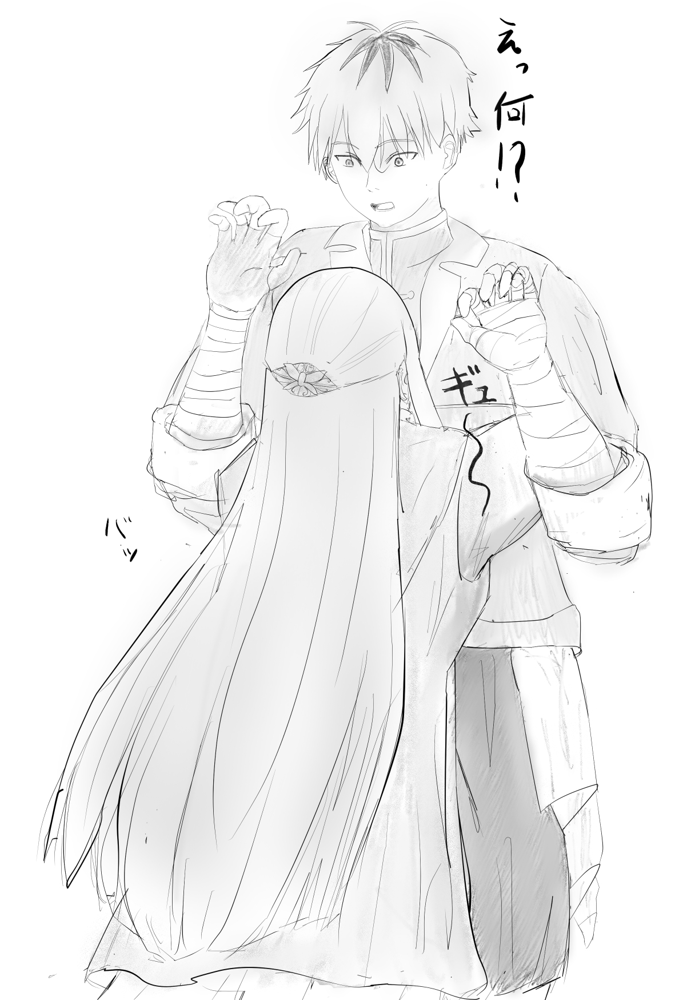

# 想いは抱擁の温もりの中に  
## 知見者に問うてみた  

中央諸国 クレ地方  

『久しいな、フェルン』  
「はい、デンケン様もお変わり無く」  

フリーレンから譲り受けたアーティファクトである水晶は、一対の組になっており、現在手元にあるものとオイサーストに送り届けたもので会話が可能な元来はとても貴重なものだ。  
ただ、所有者がダンジョンで発見したフリーレンであり、彼女の趣味の範疇で運用されているというのが伝説級のアーティファクトの現状。  

問題があるとするなら両方同時に魔力を込めなければ発動することがなく、実態としては別の媒体でいつ会話するか約束しなければ成立しない点だろうか？  
……凄いんだか凄くないんだか。  

そんな、ややこしい条件を乗り越えて通信をしているのは、フリーレンが気まぐれにラヴィーネとカンネに送ったアーティファクトを使ってでもフェルンが知見者の意見を聞いてみたいという話になったためだ。  

何を聞きたかったのか……と理由を問えば、彼女の良き相談相手である師匠のフリーレンにも相談出来ず、他者に頼らざるを得ないことなどそう多くはない。  
『結婚を前提としたお付き合いをする男女は一体、どうコミュニケーションを取るべきか？』という話。  

なんということもなく、シュタルクと相応の関係性を築いたものの相互に経験がなく……今の自分達はどういう事をするのが正しいのか？   
その客観的な意見を聞きたかったのである。  

いや、最終的にしなければならないことは判ってはいるが……そういうのはちゃんとしてからで、一般論において普段の男女はどうあるべきなのか？という話だ。  
なんせ旅ぐらしが長かったシュタルクとフェルンは単純に同じ場所にいることには割と慣れてしまっている。  
何もしなければ……なにもないのだ……それではあんまりではないか。  

まずは水晶を預かっており、年の近いラヴィーネとカンネに聞いてみた結果。  
「しらねーよ！ いい大人なんだし好きなだけ△◯☓やれよ！！」  
と言われ、ある意味解答を断られた。もっともな話ではあるのだが、それができればお互い苦労はないし、普段からそれはちょっと。  
結局その後数名をまたいで似たようなことを言われた結果  

「もう、年の近い知り合いじゃなくて結婚経験者にきいたら？」  

とカンネに言われて今に至る。  

『まあ、経緯はおおよそ聞いておるが……儂でよかったのか？  
　確かに結婚経験者ではあるが……あまり良いアドバイスができるとも思えんが』  

自分はもうずいぶん老いた身だとデンケンは髭を撫でながら遠慮がちに言うが  
身も蓋もない内容はここに来るまでの数々聞いて慣れてしまったためフェルンは冷静に返す。  

「……はい、ここに至るまでも色々あったので……もうどんなアドバイスが出ても正直驚きません。  
　むしろ、デンケン様のその配慮のお心に安心感さえ抱きます」  
『そ、そうか……』  

いったい、どんな話を聞き続けたのか……  
いや、だいたい想像はできてしまってデンケンは嘆息する。  

『年頃の男女の付き合いか……』  

## 若かりし日々  

レクテューレ……、グリュック家の一人娘として産まれ育った、少し体が弱く明るく優しい娘。  
親戚だったデンケンとは歳が近いこともあり幼い頃からよく遊んだ仲だった。  
いわゆる幼馴染であり、その時はまだそれ以上でもそれ以下でもなかった。  

「――デンケンは魔法使いになりたいの？」  
「――ああ、立派な魔法使いになって俺が魔族も魔物もやっつけてやるよ」  

まだまだ世界は平和とも言えず、悲しい出来事から、優しい彼女を守りたくて力が欲しかった。  
幼い自分には無限の可能性があり、何だって出来る。それを可能にする力があると信じて疑いもしなかった。  
口にした小さな見栄と約束がその後の人生を突き動かす原動力の起源になるとはこの時は思いもしなかったものだ。  

しかし、デンケンにとっての１つ目の悲劇は突然彼を襲った。  
魔族との抗争の中で家も両親をも失った。 

全てを失った失望感。眼の前で親の命を奪われた怒り。それでも生きていなければならない焦燥。  
何もかもが渦を巻き、張り裂けそうになる心を鎮めるため女神に救いを求めて祈り続けた。  
そんな身寄りのない自分を拾ってくれたのはグリュック家であり優しく迎え入れてくれたのもまたレクテューレだった。  

そんなある日  

『貴方に魔法を教えるようにとグリュック様から仰せつかりました』  
『……お前を殺せるほどに俺は強くなれるのか』  
『それはデンケン様次第かと』  

グリュックの勧めで黄金郷のマハトから魔法を教わることになった。  
困惑はしたが、彼の魔法の技術は人類を遥かに超えたところにあり、彼の教えは確かであった。  

そうして魔法を教わり、いつか自分の身を燃やした者達を焼き尽くす事を目指して力をつけるための日々が続いた。  
無論、年端もいかない少年が耐えられるものではない。訓練そのものではない。心の問題だ。  

復讐心というものは常に自分の身と心を焼いていた……  

## 心の支え  

「デンケン、お菓子を焼きました。休憩にしましょう」  

魔法の訓練の最中、デンケンに声をかけてくれたのはレクテューレだった。  
彼女はデンケンがグリュック家に迎え入れられてから、ずっとデンケンの傍に寄り添ってくれていた。  

憐憫するでもなく、同情するでもなく、ただ対等な家族として傍で微笑んでくれていた。  
最初は、何故彼女が何も聞かないのか、そして何も言わないのか疑問に思ったものだ。  

自身は身寄りをなくした哀れな子供であり、グリュック家はそれに同情して引き取った親切な家族だ。  

助けられた側と助けた側そういう間柄だと……そう思っていたのに。  
そんな素振りも見せず、幼い頃と変わらずいつも通り微笑んでくれていた。  
それは彼女の深い慈愛に基づいていたのだと、まだ若い己には気づく由もなかった。  

それからしばらくは……平和な日々だったように思う。  

マハトから魔法を学び、レクテューレと共に何気ない日々を過ごす。  
それは、見ようによっては……恋人のような関係にも見えたのかもしれない。  

昔から変わらぬ友達の様に、長年を共に過ごした兄妹の様に、何よりも大切な家族の様にただ傍にいてくれるレクテューレに救われていたのだ。
そう気づいたのは、いつの間にか魔法を学ぶ理由が復讐のためではなくグリュック家で過ごす日々と、  
そこにいる人達を、ただ守りたいからという理由に変わっていた事を自覚したのと同時だった。  

✧　✧　✧　✧  

『その時だったかの、レクテューレを誰よりも愛していたと気づいたのは……  
　出先から戻る馬車の中で確信し、屋敷に戻ったと同時に求婚を申し込んだ。  
　今にして思えば、意味のわからない行動だったろうな』

水晶から見えるデンケンは髭を触りながら、朗らかに笑う。  
彼なりの照れを誤魔化す仕草なのかもしれない。  

「とてもお優しい、強い方だったのですね……」  
『強い……そうだな。そうかもしれん』　　

## 熱と共に伝わる事  

幸せだった。  
マハトの元で鍛え上げられた高い魔法の資質により北側諸国の中でも成果を挙げ、ヴァイゼの家に帰れば愛する妻が待っていてくれる。  
何もかもが順風満帆で、この先どんな悲劇が起きても二人でならば歩んでいけると、そう勘違いをしていたと気づいたのはレクテューレが倒れてからだ。  

幼い頃からもともと彼女は体が弱かった。  
彼女の優しさにあぐらをかいていた自分は、そんなことすら気づけずに幸せにほうけていたのかと己を責めた。  

今の魔法の技術や医術があれば何等かの原因を究明し彼女を救えたのかもしれない。  
だが、当時は徐々に生気を失っていく彼女から漏れ出る命を止める術がなかったのだ。  

「デンケン……ごめんなさい」  
「君が謝ることなんて何もない」  
「たくさん、貴方を幸せにしてあげたかったのに……  
　今の私はあなたの子供をその腕に抱きしめてあげる小さな夢すら叶えてあげられない」  

いつも、どんなときも微笑んでいた彼女の目には涙が浮かんでいた。  
いつかこうなってしまう可能性を自分で感じていたのにずっと微笑んでデンケンを支えてくれたいたのは彼女自身の強さだったのだと痛感した。  
そしてそれに気づかずに甘えていた自分も……  

「すまない、レクテューレ、すまない……、すまない……」  

気づいてやれなかった。判ってやれなかった。救うことができなかった。  
涙を流しながら、己の無力と愚かさに後悔ばかりが山積していく。

「……デンケン……デンケンは何も悪くなんて無いの。  
　謝る必要も、涙を流す必要も何も無い……  
　そんなことより、あなたが温かい人で良かった。  
　北部の冬は冷えますから、あなたが抱きしめていて……くれたら……凍えること無く眠れる……」  

それ以降、妻レクテューレは徐々に体調を悪くしていった。
デンケンは、必死に名声を求めた。位が上がれば資金が手に入る。  
金があれば……様々な手が打てる。そうすれば妻は……妻の命は……そう思い、がむしゃらだった。

そうして、宮廷魔道士としての最高位を手にした頃。妻はもうベッドから体を起こすことすら困難になっていた。

「デンケン……、ごめんなさい。
　もう自分で起き上がることも出来ない」

デンケンは自分に向かって手を伸ばす彼女の手を取って応える

「レクテューレ……もうすぐだ。もうすぐ叙勲式を受けて宮廷魔道士最高位が手に入る。  
　そうすれば……きっと……キミの病を直す手を打てる」  

「また、偉くなったの？  
　おめでとう。凄いわデンケン。あなたならきっと、沢山の人を救えるわ……」  
「ちがう、ちがうんだレクテューレ。俺はキミが、君を助けたくて……」  

手を伸ばしたレクテューレは人差し指をデンケンの口元に添える。  
こうされては黙る他無い。

「デンケン、寒いわ……いつもみたいに温めて……」
「レクテューレ……」

身動きの出来ない妻を少し抱き上げで抱きしめる。  
心身の弱った妻と許された僅かな逢瀬。  

「温かい……、あなたの想いが、優しさが、温かさを通して……よく伝わってくる。  
　私のも伝わった……かしら……」

妻の身体は……もはや人間の体温としてはありえないほど冷たい。  
もう、残された時間はそう多くない。その焦燥ばかりが頭をよぎる。

「……ああ、……ああ、レクテューレ……温かいよ。君の想いとぬくもりを感じる……」  

かすかに感じるぬくもりから彼女がまだ必死に生きて、自分を愛してくれているのだと感じる。
その言葉を聞いたレクテューレは「ああ、よかったぁ……」といいながら眠りについた。

## 言葉がなくとも伝えられること

『結局それが、妻のレクテューレとの最後の会話になってしまった。  
　その後の顛末は、お前たちも知ってのとおりだ。
　儂が叙勲式に向かう一方で妻の状態はますます悪化し、勲式から帰った頃には妻は息を引き取った後だった。  
　儂は妻の死に目にすら会えなかった』

「……そう、だったのですね」

フェルンが深刻そうな顔で言葉を選んでいるのでデンケンは余計な長話をしすぎたなと反省する。

『少々、余計な話をしすぎた。話を戻そう。
　小僧に……いや、もう小僧ではないか。シュタルクに、普段から愛情を伝えるためにどうしたらいいか……だったか？』
「えっと……」

フェルンとしてはそこまで深刻な話ではなかったのだが、先程までの話を聞いたうえで「もう少し浮ついた気持ちでした」とは言い難い。
言葉を選んでいるとデンケンが先に口を開いた。

『抱きしめてやるといい』
「……抱きしめる……？」

『それだけで伝わる気持ちがある。 儂は……そう思う……』

そう言ってから、老人特有の柔らかな笑顔を浮かべたあと

『むしろ、儂はそれしか知らんかった
　……これで答えになっているかな？』

短い時を共に愛し合った何もかもがそれに詰まっている。
デンケンとレクテューレの逢瀬の表現は本当にそれが唯一であり全てだったのであろう。
悲しく淋しいようで、とても優しい答えなのだとフェルンは思った。

「……はい。ありがとうございます」
『ふむ、こんな事で未来ある若人の役に立てたのならよかったよ』

そう言って、水晶のアーティファクトに手をかざし通信を切ろうとした刹那。

「デンケン様！」

フェルンが声をかけた。

『どうした、まだなにかあるか？』  
「いえ……、これは、あくまで同性の女性としての意見ですが……」  
『ほう』  
「共に人生を最後まで歩めなかったとしても、最後まデンケン様を愛し抜いたその日々はレクテューレ様にとってはかけがえもなく幸せだったのだと……思います」

そう言ったフェルンの言葉を聞いたデンケンは少し目を見開いて驚いた様子だった。

『くっ……ははっ……はははは。そうか。そう思ってくれるか。  
　よかったよ、口数少なく聞いていたので退屈させてしまったのかと思ってしまった』  
「い、いえ、そんな事は……」

『そうやって、一人の愚か者を救うために慈愛と共に生きた女性が一人いたことを覚えていてやってくれると嬉しい。なんせ儂らには子がいない』

「いつかまた、ヴァイゼに立ち寄ることがあればレクテューレ様にも華を添えようと思います」

そうれを聞いたデンケンは『ありがとう』と満足げに応えて今度こそアーティファクトの魔力を停止した。

## 語られずとも

「ただいまー」

と、玄関の扉を開けたのはシュタルク。現在彼はグラナト領都との間を往復生活だ。
理由は様々あるが……

「おかえりシュタルク。どうだった？」
「全然駄目だって現地で手直しされまくった……」

基本的には今住んでいるクレ地方の管理の手続きと彼の勉学のためだ。
指導・鞭撻してくれることはとてもありがたいことだ。だが、やっぱり慣れなくてしんどいものはしんどい。

「おかえりなさい、シュタルク様」
「ただいま、フェルン」

つい先程デンケンとの話を思い出し、
どうしたいのかを切り出すには少しばかり勇気が要る。

シュタルクの顔を見るのは数日ぶりだ。色々言いたいことはある。
ご苦労さまとか、自分達のためにいつもありがとうとか、でも数日会えなかったのはとても寂しかったとか……

想いを全部のせればきっと伝わる……
こういうときこそ素直になるべき一瞬なのだと。拳を握りしめ己を鼓舞する。

「シュタルク様。その……お話というか……お願いがあります」
「ん？？」

――抱きしめてやるといい。それだけで伝わる気持ちがある。

熱に思いを込めて、身体を合わせ温かさを共有するだけ。それだけで伝わる。
これはそんな。小さな愛情表現のお話だ。

～ fin ～

# ご意見等

ご意見、コメント等は[マシュマロ](https://marshmallow-qa.com/g6ovizis0w4yvse?t=0p4BNL&utm_medium=url_text&utm_source=promotion)または[X](https://x.com/rvr75_raiden/)まで。

リクエストなどもあれば遠慮なくどうぞ