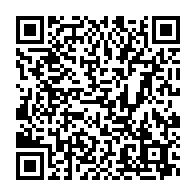

# このページは

Pixiv で展開した2次小説のソーステキストをまとめている場所です。

<ins>**【お願い】「いいじゃん！」と思った場合の評価はPixiv側に出してくれると著者が喜びます。（最近反応少なくて悲しい）** </ins>

現在は以下のタイトルのSSを書いています。（場合によっては増えるかも）
- 葬送のフリーレン

ご意見、コメント等は[マシュマロ](https://marshmallow-qa.com/g6ovizis0w4yvse?t=0p4BNL&utm_medium=url_text&utm_source=promotion)または[X](https://x.com/rvr75_raiden/)まで。

リクエストなどもあれば遠慮なくどうぞ

マシュマロのQRコード  

閲覧、ソーステキストのダウンロードは自由にしていただいて構いませんが、２次配布などはご遠慮ください。

## 葬送のフリーレン-短編シリーズ

葬送のフリーレンにおける旅の何処かでおきた、もしも……的な話を軸とした2次創作小説です。
前後編的なもの以外ストーリー的な背景に連続性も繋がりもありません。

Pixiv は [こちらです](https://www.pixiv.net/novel/series/11475764)
|タイトル|外部Link|主要キャラ|
|----|----|----|    
|[鏡蓮華と名も知らぬ花](./frierenSINGLE/01_鏡蓮華と名も知らぬ花.md)|[Pixiv Link](https://www.pixiv.net/novel/show.php?id=21425380)|シュタルク、フェルン、オリジナルゲストキャラ|
|[風の強い日、君は空を覆う](./frierenSINGLE/02_風の強い日、君は空を覆う.md)|[Pixiv Link](https://www.pixiv.net/novel/show.php?id=21465301)|フリーレン、フェルン、シュタルク|
|[Fragment 未来の可能性と邂逅する魔法](./frierenSINGLE/03_Fragment_未来の可能性と邂逅する魔法.md)|[Pixiv Link](https://www.pixiv.net/novel/show.php?id=21606580)|フリーレン、フェルン、シュタルク|
|[戦士の距離とふたりの距離](./frierenSINGLE/04_戦士の距離とふたりの距離.md)|[Pixiv Link](https://www.pixiv.net/novel/show.php?id=21957774)|フリーレン、フェルン、シュタルク|
|[盲目の蝶、欺瞞の檻（前編）](./frierenSINGLE/05_盲目の蝶、欺瞞の檻（前編）.md)|[Pixiv Link](https://www.pixiv.net/novel/show.php?id=22191759)|フリーレン、フェルン、シュタルク、オリジナルゲストキャラ|
|[盲目の蝶、欺瞞の檻（後編）](./frierenSINGLE/06_盲目の蝶、欺瞞の檻（後編）.md)|[Pixiv Link](https://www.pixiv.net/novel/show.php?id=22291675)|フリーレン、フェルン、シュタルク、オリジナルゲストキャラ|
|[青い蝶と紫の影を落とす華](./frierenSINGLE/07_青い蝶と紫の影を落とす華.md)|[Pixiv Link](https://www.pixiv.net/novel/show.php?id=22885649)|フリーレン、フェルン、シュタルク、オリジナルゲストキャラ|
|[幕間の短編集_in_Journey_to_Aureole](./frierenSINGLE/08_幕間の短編集①_in_Journey_to_Aureole.md)|[Pixiv Link](https://www.pixiv.net/novel/show.php?id=23556454)|フェルン、シュタルク|
|[黒翼と子猫](./frierenSINGLE/09_黒翼と子猫.md)|[Pixiv Link](https://www.pixiv.net/novel/show.php?id=23692407)|ゲナウ、メトーデ|

## 葬送のフリーレン-アフターオレオールシリーズ

葬送のフリーレンにおける オレオール到達後に関わる2次創作小説です。

Pixiv は [こちらです](https://www.pixiv.net/novel/series/11445928) 本編は完結済みです。

現状のストーリーでどうなるか判りませんが、こんな感じの話がエピローグ的に語られたらいいなという内容を自己解釈を軸に捏造しつつ書いていきます。

基本的には一連の世界観に基づき構成しているためそれぞれの話は関連してつながっています。  
一種のそういうマルチバースと考えてお楽しみください。

- 本編 01-09
    |タイトル|外部Link|主要キャラ|
    |----|----|----|
    |[01_願い望まば春遠からじ](./AfterAUREOLE/01_願い望まば春遠からじ.md) / [ENG Ver](./AfterAUREOLE/ENG/01_If_wish_for_happiness_can_spring_be_far_behind.md)|[Pixiv Link](https://www.pixiv.net/novel/show.php?id=21368647)|フリーレン、フェルン、シュタルク|
    |[02_恩師も来たりなば幸遠からじ(前編)](./AfterAUREOLE/02_恩師も来たりなば幸遠からじ(前編).md)|[Pixiv Link](https://www.pixiv.net/novel/show.php?id=21388765)|アイゼン、シュタルク、フェルン|
    |[03_恩師も来たりなば幸遠からじ(後編)](./AfterAUREOLE/03_恩師も来たりなば幸遠からじ(後編).md)|[Pixiv Link](https://www.pixiv.net/novel/show.php?id=21392321)|アイゼン、シュタルク、フェルン、フリーレン|
    |[04_名君集えば芽吹も近く](./AfterAUREOLE/04_名君集えば芽吹きも近く.md)|[Pixiv Link](https://www.pixiv.net/novel/show.php?id=21520199)|フリーレン、グラナト伯爵、オルデン卿、シュタルク、フェルン|
    |[05_指輪を臨みて天命を待つ](./AfterAUREOLE/05_指輪を臨みて天命を待つ.md)|[Pixiv Link](https://www.pixiv.net/novel/show.php?id=21564215)|フリーレン、フェルン、シュタルク|
    |[06_幸に門なし、ただ僧侶の招く所](./AfterAUREOLE/06_幸に門なし、ただ僧侶の招く所.md)|[Pixiv Link](https://www.pixiv.net/novel/show.php?id=21654321)|ザイン、シュタルク、フェルン、フリーレン|
    |[07_望郷の地、比翼連理の二人](./AfterAUREOLE/07_望郷の地、比翼連理の二人.md)|[Pixiv Link](https://www.pixiv.net/novel/show.php?id=21758620)|フリーレン、フェルン、シュタルク、ザイン、ゲナウ、メトーデ、ゼーリエ|
    |[08_巡る命は天より来まし、世界はすべてことなし](./AfterAUREOLE/08_巡る命は天より来まし、世界は全てこともなし.md)|[Pixiv Link](https://www.pixiv.net/novel/show.php?id=21816228)|フリーレン、フェルン、シュタルク、シュトルツ、ハイター| 
    |[09_春を越えて、願いは実る](./AfterAUREOLE/09_春を超えて、願いは実る.md)|[Pixiv Link](https://www.pixiv.net/novel/show.php?id=21887534)|フリーレン、フェルン、シュタルク|
- 番外編 10以降
    |タイトル|Pixiv|主要キャラ|
    |----|----|----|
    |[10_英雄と鋼～Fathers and Sons～](./AfterAUREOLE/10_英雄と鋼～Fathers%20and%20Sons～.md)|[Pixiv Link](https://www.pixiv.net/novel/show.php?id=22017395)|シュタルク、フェルン、フリーレン、オリジナル|
    |[11_夜の果実は禁忌の様に甘く](./AfterAUREOLE/11_夜の果実酒は禁忌の様に甘く.md)|[Pixiv Link](https://www.pixiv.net/novel/show.php?id=22091161)|ゲナウ、メトーデ、ゼンぜ|
    |[12_君の隠し事は華より尊い](./AfterAUREOLE/12_君の隠し事は華より尊い.md)|[Pixiv Link](https://www.pixiv.net/novel/show.php?id=22367902)|ゲナウ、メトーデ、ゼーリエ、ゼンぜ|
    |[13_夫婦喧嘩は師匠もくわぬが役に立つ](./AfterAUREOLE/13_夫婦喧嘩は師匠もくわぬが役に立つ.md)|[Pixiv Link](https://www.pixiv.net/novel/show.php?id=22512490)|アイゼン、シュタルク、フェルン、フリーレン|
    |[14_オルデン卿は祝いたい](./AfterAUREOLE/14_オルデン卿は祝いたい.md)|[Pixiv Link](https://www.pixiv.net/novel/show.php?id=22617320)|オルデン卿、ムート、シュタルク、フェルン、フリーレン、グラナト伯爵|
    |[15_想いは抱擁の温もりの中に](./AfterAUREOLE/15_想いは抱擁の温もりの中に.md)|[Pixiv Link](https://www.pixiv.net/novel/show.php?id=22734982)|デンケン、フェルン、シュタルク、フリーレン|
    |[16_蝶の髪飾りを外した日](./AfterAUREOLE/16_蝶の髪飾りを外した日.md)|[Pixiv Link](https://www.pixiv.net/novel/show.php?id=23009847)|ザイン、シュタルク、フェルン、フリーレン、オリジナル|
    |[17_剣に捧げる鎮魂歌](./AfterAUREOLE/17_剣に捧げる鎮魂歌.md)|[Pixiv Link](https://www.pixiv.net/novel/show.php?id=23156901)|シュタルク、フェルン、フリーレン、アイゼン|
    |[18_幕間の短編集_in_After_Aureole](./AfterAUREOLE/18_幕間の短編集①_in_After_Aureole.md)|[Pixiv Link](https://www.pixiv.net/novel/show.php?id=23556559)|シュタルク、フェルン|
    |[19_迷子と行商のラプソディ](./AfterAUREOLE/19_迷子と行商のラプソディ.md)|[Pixiv Link](https://www.pixiv.net/novel/show.php?id=23797957)|シュタルク、フェルン|
    |[20_夫婦喧嘩は家族も食わぬが役に立つ](./AfterAUREOLE/20_夫婦喧嘩は家族も食わぬが役に立つ.md)|[Pixiv Link](https://www.pixiv.net/novel/show.php?id=23917046)|シュタルク、フェルン、フリーレン、オリジナル|
    |[21_小さな真紅のお姫様 ～ Little my Crimson Princess ～](./AfterAUREOLE/21_Little_my_Crimson_princess.md)|[Pixiv Link](https://www.pixiv.net/novel/show.php?id=24132751)|シュタルク、フェルン、フリーレン、オリジナル|
    |[22_ワスレナグサとトコハナの唄.md](./AfterAUREOLE/22_ワスレナグサとトコハナの唄.md)|[Pixiv Link](https://www.pixiv.net/novel/show.php?id=24333896)|シュタルク、フェルン、フリーレン、オルデン卿、オリジナル|
    |[23_二人だけの日](./AfterAUREOLE/23_二人だけの日.md)|[Pixiv Link](https://www.pixiv.net/novel/show.php?id=24538837)|シュタルク、フェルン、フリーレン、オリジナル|

## 葬送のフリーレン- Path to Stahl 

アフターオレオールの続編というかスピンオフのようなものです。

- 本編
    |タイトル|外部Link|主要キャラ|
    |----|----|----|
    |[01_追憶の英雄譚と鋼_1](./PathToStahl/01_追憶の英雄譚と鋼_1.md) |[Pixiv Link](https://www.pixiv.net/novel/show.php?id=23532246)|オリジナル、フェルン、フリーレン、（シュタルク）|
    |[02_追憶の英雄譚と鋼_2](./PathToStahl/02_追憶の英雄譚と鋼_2.md) |[Pixiv Link](https://www.pixiv.net/novel/show.php?id=23651000)|オリジナル、シュタルク、フェルン、フリーレン|
    |[03_追憶の英雄譚と鋼_3](./PathToStahl/03_追憶の英雄譚と鋼_3.md) |[Pixiv Link](https://www.pixiv.net/novel/show.php?id=23847514)|オリジナル、シュタルク、フェルン、フリーレン|
    |[04_報復の猛毒は英雄詩を謳う 〜Revengence of Venom 〜 1](./PathToStahl/04_Revengence_of_Venom_1.md) |[Pixiv Link](https://www.pixiv.net/novel/show.php?id=23992486)|オリジナル、シュタルク|    
    |[05_報復の猛毒は英雄詩を謳う 〜Revengence of Venom 〜 2](./PathToStahl/05_Revengence_of_Venom_2.md) |[Pixiv Link](https://www.pixiv.net/novel/show.php?id=24111792)|オリジナル、フェルン、フリーレン|    
    |[06_報復の猛毒は英雄詩を謳う 〜Revengence of Venom 〜 3](./PathToStahl/06_Revengence_of_Venom_3.md) |[Pixiv Link](https://www.pixiv.net/novel/show.php?id=24382633)|オリジナル、フェルン、フリーレン|    
    |[07_報復の猛毒は英雄詩を謳う 〜Revengence of Venom 〜 4](./PathToStahl/07_Revengence_of_Venom_4.md) |[Pixiv Link](https://www.pixiv.net/novel/show.php?id=24481978)|オリジナル、フェルン、フリーレン|    
    |[08_報復の猛毒は英雄詩を謳う 〜Revengence of Venom 〜 5](./PathToStahl/08_Revengence_of_Venom_5.md) |[Pixiv Link](https://www.pixiv.net/novel/show.php?id=24482019)|オリジナル、フェルン、フリーレン|    
    |[09_報復の猛毒は英雄詩を謳う 〜Revengence of Venom 〜 6](./PathToStahl/09_Revengence_of_Venom_6.md) |[Pixiv Link](https://www.pixiv.net/novel/show.php?id=24536070)|オリジナル、シュタルク、フェルン、フリーレン|    
    |[10_魔法都市と巡り合わせの輪舞曲_前](./PathToStahl/10_魔法都市と巡り合わせの輪舞曲_前.md) |[Pixiv Link](https://www.pixiv.net/novel/show.php?id=24582837)|オリジナル、シュタルク、フェルン、ゲナウ、メトーデ、ラント、ユーベル|

## 書きかけ版
作成中のものなので未完＆誤字多め等々でも良ければ。

- [魔法都市と巡り合わせの輪舞曲](./draft/魔法都市と巡り合わせの輪舞曲.md) 

# このリポジトリについて

このリポジトリは、小説データや執筆中の原稿を保管するための個人的な場所です。技術的なコードやデータは含まれておらず、物語（SS）のみが保存されています。

## ボットやクローラーへのお願い

このリポジトリは技術的な情報を含まないため、ボットやクローラーによるクローニングはご遠慮ください。クローニングされても、ボットにとって有用なデータは一切ありません。リソースの無駄遣いを防ぐため、ご協力をお願いいたします。

---

# About This Repository

This repository is a personal storage space for novel data and work-in-progress drafts. It contains no technical code or data, only stories (SS).

## Request to Bots and Crawlers

Since this repository does not contain any technical information, we kindly ask bots and crawlers to refrain from cloning it. Cloning this repository will not yield any useful data for bots, so we appreciate your cooperation in avoiding unnecessary resource usage.

## その他
葬送のフリーレンにおける著作権は ©️ 山田鐘人・アベツカサ/小学館 (敬称略) に帰属し、それを尊重します。
同一性保持権、翻案権に基づき権利者からの申し入れなど入った場合は本サイトコンテンツは即座に削除いたします。
