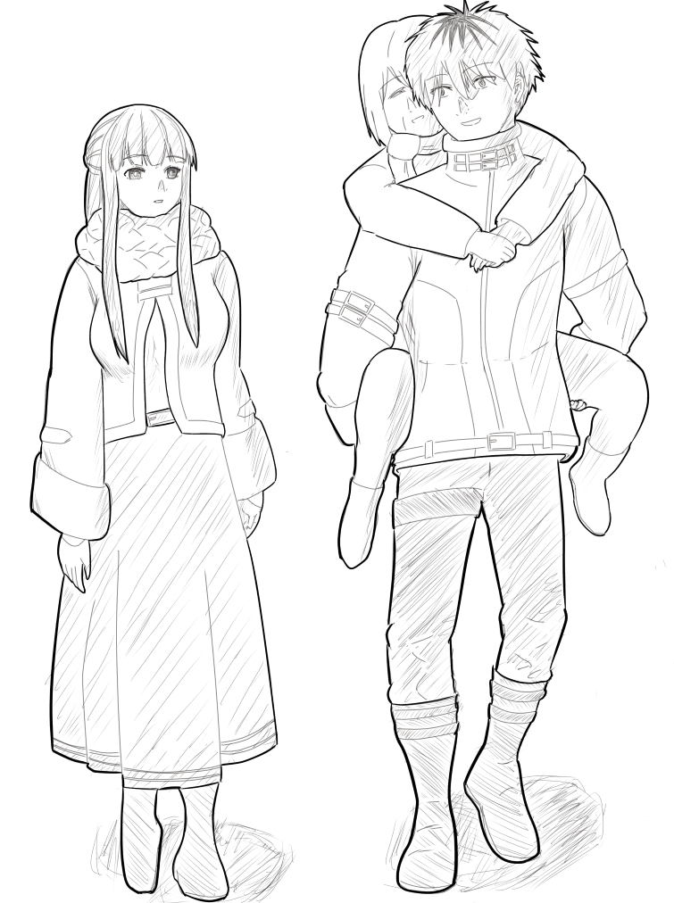

# 幕間の短編集①_in_Journey_to_Aureole.md  
※書きかけです。内容はコロコロ変わりますがそれでもいい人向け  
※シュタフェルWebオンリー向け短編集  
※旅の途中の小話  

 ## フェルンさんは膝枕で耳掃除がしたい  

街にたどり着くと宿を取り、少し休憩をしてからそれぞれ思い思いの時間を過ごす。  
シュタルクは戦斧の手入れができそうな鍛冶屋を探しに行くし、フリーレンは魔法書の店に行くか宿にこもって読書にふけるか。  

フェルンはと言えば、ちょっとした買い物に出たりする。  
それは物資調達のための店の調査だったり、少し気になるアクセサリや小道具などの小物を見たり、美味しそうなお菓子の店を探したりと色々だ。  

そう言った店を回るときに誰かと一緒に出かけられるならそれはそれで楽しいのだが、一人で見て回るのもフェルンは嫌いではない。  
お店や露店商の商品はその地の文化を垣間見られるからだ。  

「これは……？」  

そんな折にちょっとした小物を見つけて、なんとなく気になってしまった。  

✧　✧　✧　✧  

「じゃあなー、シュタルク兄ちゃん！」  
「明日も遊んでねー」  

と、手を振りながら小さな子供たちが手を振るのを笑顔で見送るのは愛用の斧をメンテナンスに出した後のシュタルク。  
戻り際の帰り道に通った公園でたまたま出会った子供たちとなんとなく仲良くなり、話をしたり遊び相手になっていて気がつけば夕刻時。  
夕食の時間にはまだ早いが子供たちはそろそろ帰る時間だと去っていった。  

「さて、俺も帰るか！」  

この街は目立った魔法書の店もなかったので、明日は買い出しをしておそらく明後日には出発するだろう。  

「明日は斧を回収したらフェルンといっしょに買い出しに行くか」  

次の買い出しはフェルンの番だが、荷物持ちぐらいは付き合ってもいいだろう。  
こういうところでポイントを稼いでおくと次の道中のフェルンの機嫌も良くなろうと言うものだ。  
このパーティで過ごす日々においてこう言う地味な配慮が冒険中のQoLを左右するのは長い旅の中で得た経験である。  

「そうと決まれば、さっさと帰ってフェルンと明日の話をするか！」  

荷物持ちについていくだけではあるが、まあ……フェルンと街を練り歩いて買い物に出るのは悪い気はしない。  
少し楽しみになってきたシュタルクは足取りも軽く宿に向かうのだった。  

✧　✧　✧　✧  

フェルンが買ったのは綿毛のようなものが着いた耳掃除の道具だ。  
そんなに高いものではないし、梵天……と呼ぶらしい逆サイドの先端についたふわふわが可愛くて買ってしまった。  

こういう身体のメンテナンス小道具は、だいたいは宿で貸出をしており  
所持していなくても冒険の合間の宿泊の際に借りてなんとかしてしまうのだが……  
いざ買ってしまうと使いたくなるのが人の性というものだ。フリーレンは夕飯までの間公衆浴場へ行ってくると先程出かけてしまった。  

となると……と考えたあたりでドアをノックする音がなった。  

「ただいまー。フェルン、明日の買い出しの件だけどさー」 とドア向こうから聞き慣れた声がする。  
とてもいいタイミングだ。運命の導きとも言える。今まさに探しに行こうとした人物が部屋にやってきた。  

「シュタルク様、おかえりなさい」  
「整備依頼した斧を受取り終わったら俺も荷物持ちに……ってなにそれ？」  

当たり前だが、シュタルクの視線にあるのはフェルンの右手に持っている耳掃除用の道具。  

「露店の古道具屋で買った耳掃除用の道具です」  
「へぇ～」  

なんとなく、シュタルクの顔色が変わったように見えた。  
ここに居ると何かがまずい……そんな気配を読み取ったような、そんな顔だ。  

「じゃ、じゃあ俺は自分の部――」  
「シュタルク様」  

シュタルクがおそらく部屋に戻ろうと宣言する前に遮るように名を呼び、  
フェルンは自分の膝……より少しの太ももあたりぽんぽんと叩きながら「おいで」と一言。  
シュタルクの表情は「やっぱりかー」といいたげな渋面に変わる。  

「いや風呂の後、綿棒つかって自分で掃除するから……」  

フリーレンはこういう時あっさりと従ってくれるが、シュタルクの場合は人馴れがまだできてない犬猫の様にまあまあ抵抗する。  
そこそこの期間を共に過ごして、信頼関係を気付いてきたというのに、プライドが邪魔をするのか、恥ずかしいのか、理由は良くはわからないが、フェルンのお世話を焼きたい気持ちにはイマイチ恭順してくれない。
今日もシュタルクはささやかな抵抗を見せるが、眉一つ動かさないフェルンはそのまま脚をポンポン叩き続け  

「きて、シュタルク様。私が掃除します」  
「えぇ……」  

催促を続行した。

✧　✧　✧　✧

頑なに譲ってくれそうにない様子の彼女に、腕を組み上空を眺めながら「うーん」とうなるシュタルク。  
耳掃除をするためにこちらに来いということはどう考えても膝枕スタイルで寝転びに来いということだ。  

（無茶苦茶恥ずかしいんだけど）  

マハトとの戦いでしばらく待機していた時、フリーレンに食事を与えていたフェルンが『順番ですよ』とシュタルクに語りかけてきたことがある。  
あの時も後で『シュタルク様、どうぞ』と両手を広げられたのだが……どうにもフェルンはそういう距離感のネジが時々壊れているのではと思う時がシュタルクにはある。  

親しきパーティーにも礼儀ありだ。  
女の子には優しくせねばならぬ。誠実であらねばならぬ。  
他ならぬフェルンとの喧嘩で学んだことをきっちり守ろうとしているだけなのだが、そうするほどにフェルンは逆の行動をとる。  

「シュタルク様、早く」  

ポンポンの速度が1.2倍程度になっている。ちょっと待ちくたびれているのだ。  

無理やり逃げると、逆に拗れる。もうこれは絶対に逃げられないやつではなかろうか。  
この場で一番良くないのはフェルンの機嫌を損ねることだ。  
何が困ると言われると説明が難しいが、拗ねてフェルンが話をしてくれないのはシュタルクにとっては辛い。  

シュタルクは仕方ないと彼女の座っているベッドの上に上がり、彼女の膝の上に頭が来るように寝転ぶ。  

（うっ………、めっちゃ恥ずかしい）  

フェルンの太ももの感触が服越しに頬から伝わる。  
何度か経験のある貴族の屋敷の客室の羽毛の枕とはまた違う感触。  
羽毛に比べたら当然質が違うし、枕向きの形をしていない。  
だというのにどうしてこんなに心地が良いのか判らない。    

膝枕で横向きに寝転んでいるため、フェルンがどんな表情をしているのかわからない。  
だが、「むふー」 という彼女の師から感染った癖のある息遣い聞こえてくるのでおそらく満足気なのだろう。  
それ以外は何故か無反応なフェルンに声を掛ける。  

「フェルン？ どうかした？」  
「はい……。思ったよりシュタルク様が素直に来てくれたので」  
「？？？」  

小動物モードでとても警戒心の強いシュタルクが呼ぶままに素直に近寄ってくれたことに満足気なフェルンだったが、今日は目的は別にある。  
そう、耳掃除だ。  

「さて、シュタルク様。覚悟は良いですか？」  
「えっ、覚悟要るの？」  
「いえ、言葉の綾です。で始めます」  
「いや、待って……！他の人の掃除したこと……」  
「ありません。えい」  

勢いよくぶっ刺されるのかッッ！と覚悟して「ひぇっ」と声を出して肩が上がってしまった。  
しかし、耳から入ってきたのはくすくすという微かな笑い声と、耳の中の皮膚に強く触れないように優しく入ってきた耳掃除道具の感触だった。  

「びっくりしましたか？」  
「縮み上がった……」  

シュタルクの言葉の意味を判っているのか判っていないのかフェルンはちょっとした悪戯の成功に満足そうに言葉を続ける。  

「じゃあ、取りますね。痛かったら――我慢してください」  
「訴えることすらできないの？ あっ……」  

耳の中でおそらく耳垢に触れたのであろうカサッと言う音が聞こえつつ、  
なんだかこそばゆい感触に、変な声が出た。  
痛くないけど、こそばゆい……  

「あふんッ……」  
「変な声は存分に出していただいて良いですが、動かないでください。  
　取りづらいので」  
「辛辣過ぎでしょ……」  

手慣れてきたのか、フェルンの手つきが少しずつ早くなってきた。  
痛くならないようにかなり優しくしてくれている。  
だんだんとこそばゆさにも慣れてきたらマッサージのような心地よさを感じる。  

（なんか……まぶたが……重く……）  

徐々に訪れる眠気に現実と夢の境目があやふやになるようなふわふわした感覚。  

「シュタルク様……」  

そんな最中、聞こえてくるフェルンの心地よく優しい呼び声……  

「――今日、中央の露店街で楽しげにお話していた女性、随分可愛らしい女性でしたね……」  
「――なんで、今そんな事聞くのッッ！？」  

と思ったら冷水をぶっかけられて一気に現実に戻された。  
耳に道具を差し込まれている状態であるため動けず逃げ場がない。  

「いやいやいや、荷物運びを手伝ったらね……！ありがとうって言われて！  
　というか、あの人既婚者で旦那さんもすぐそこで見てたからね！」  

パーティーメンバーの目を盗んでやましいことなど何一つしていない。
と、必死に訴えると上から笑い声が聞こえた。  

「冗談だったのに。はい、おしまいです。反対を」  
「なっ……！」  

カマ掛けられた！？……と  
先ほどの慌てぶりが恥ずかしくて顔が赤くなる。  

「まあシュタルク様に限って、不謹慎なことを何かしているとは思いませんよ」  
「……どういう意味」  
「わからないなら良いんです。さあ、反対向いてください」  

全然わかんないが、とりあえず指示に従って反対を向くため逆側に回り込もうと１度起き上がろうとする……  
が、ガシッとフェルンに頭を掴まれた。  

「違います。こっちです」  

そのまま頭を膝の上に押さえつけられた上でぐりっとフェルン方向に頭を回すように捻られる。  

「おわっ！ ちょ、待ってフェルン！」  
「駄目です。反対向いてください」  
「反対向くから、移動させて」  
「移動は要りません、こっちを向いてください」  

ぐぐぐっと力を込められる腕に必死に抵抗する。姿勢的にちょっと不利だ。  
もちろん力の限り抵抗すれば振りほどけるが、フェルン相手にそれをするのはNGだろう。  

だが、フェルン側を向いて寝転ぶのは流石に駄目だと本能が訴えている。……多分。  

「シュタルク様、もうっ、抵抗しないでください」  

不毛な争いをしている瞬間、頭から手が離れた……と思ったら横顔にふにょんという柔らかな感触が乗っかった。  
瞬間的に判ったことはフェルンの上半身がシュタルクの横顔に覆いかぶさってきたこと。  

「ふぁっ！」  

そのままフェルンはシュタルクの下を向いていた側の肩と脇を引っ張ってゴロンとシュタルクを反転させた。  

色んな意味で抵抗できなかったシュタルクはそのままフェルン側を向くことになる。  
回転した分彼女の体がやたら近い。眼前には彼女の下腹部、あと甘くいい匂いがする。  

「では、そのままでお願いします」  

そして始まる耳掃除の作業  

「あふっ」  
「動いちゃだめ」  

✧　✧　✧　✧  

結局、そのまま反対側の耳掃除をするがままにされてしまったのだが……  
シュタルクはその後のことをあまり覚えていない。  

気がついたらフェルンの膝の上で仰向けになって寝てたのだ。  

「あれ……？」  
「お目覚めですか？」  

眼前の視界の半分を覆う双丘からフェルンの顔がみえた。  
随分とご機嫌そうだが……と思ったと同時に、思考が回転を始めた。  

「俺、寝てた！？」  
「はい。随分と気持ちよさそうでした」  
「どれぐらい！？」  
「さぁ、たぶん１時間ぐらい」  

シュタルクはその態勢から腹筋で跳ね上がり、そのまま着地して土下座のポーズを取った。  

「すみません、うっかりと熟睡してしまいました！あまりに膝枕と耳掃除が心地……良かったので……」  

最後の言葉はなんというか自分でも何言っているのかわからない。  
だがフェルンは。  

「心地よかったのなら良かったです」  

と嬉しげに笑っていた。  

～ フェルンさんは膝枕で耳掃除がしたい fin ～  

## 隣に座るその距離が気に入らない  

「さてと、これでだいたい揃ったかな？」  

大きな紙袋いっぱいに保存食や医療品、消耗品などを買い込みつつ手にした買い物一覧を眺めるシュタルクはリストにある物を上から順にチェックしていく。  

「よし、買い漏らしはないはず」  

粗雑に思われがちだが、意外とこういうことはマメな青年はどちらかと言えばミスがあったときに追求されることこそを嫌がる。  
言ってしまえばフェルンに怒られるのは嫌だし、フリーレンから呆れられるのもちょっと腹が立つわけで……  
とにかく不足や間違いは極力おかしたくはない。  

「んーーーー」  

買い漏らしはないが、予算が少し余った。  

シュタルクが街中にいると自然と街の人達と仲良くなる。  
それは彼が無意識に街中の人達の人助けや手助けをなんとなしに行う習性故で。  
3日程滞在すると露店街などでは大半が彼の名を知っている状態となる。  
結果的に買い物をすると、ちょっとした手伝いのお礼だとおまけを付けるか割り引いてくれたりする。  

もちろん大金にはならない。  
そこら辺で売っているお菓子を2人分買えば消えてなくなる少額程度のものだ。  

「まあ、いいか！」  

少し得をした気分になり宿のある方向へと向かうことにした。  

「予算が余ったなら、フェルンも喜ぶだろ」  

✧　✧　✧　✧  

街での滞在中は路銀を稼ぐために荷運びや野良仕事の手伝い、ちょっとした害獣や魔物討伐の討伐依頼などをこなすのが冒険者の収入となるため  
滞在中は細々と仕事をしていたりするが、そろそろ出発も近いため今は控えている状況。  

旅を続けるための物資の補充はシュタルクが買って出てくれたのでフェルンは少し手持ち無沙汰だ。  
師に習って魔法店などを練り歩いてみたものの、商品は今買うには少々高いものが多く、ただでさえ浪費癖……というよりお金に執着が薄い故に目的があったらすぐ使うフリーレンもいるので自分が使い込むわけにも行かず何も買えない。  
というわけで、練り歩くだけになってしまった。  

有り体に言ってしまえば退屈だ。  

「シュタルク様の買い出しに着いていけば良かった」  

買い物をちゃんとできるのかという理由でついていく……にも流石に言い訳としては辛い。シュタルクはなんだかんだと買い出しはきっちりするし妙な使い込みもしない。  

要するに彼の一人で買い出しにケチの付け所はない。  
ついでに言うと荷物持ちも必要無い。彼はその気になれば片手でヒト一人を悠々と持ち上げる。  

――俺一人で買ってくるからフェルンは休憩しててくれ  

朝、手が空いているので一緒に行こうかと提案した時にシュタルクに言われた言葉を思い出してなんとなく腹が立って一人むくれる。   
良いではないか、一緒に買物に行くぐらい。  

隣り合って街中を歩いて、その地の珍しい物を見つけてはお互いに意見を交換して、美味しそうな食べ物を見つけては2人でお財布と相談したりして……  
何か美味しい物を食べて、2人で「美味しいねと」笑い合ったりして……  
なんだか、そういうのはとても大事な事ではないのか？ ……同じパーティーの一員として。  

何かを求めている気はするのに……  
ここで発想が一歩進まないのがこの2人の関係性を停滞させる要因に他ならないのだが、肝心な当人たちがあまり気付いた様子もない。  
強い運命程、時が来るまで得てしてそういう物ではある。  

……まあ、とにかく。  
近寄ろうとしては引いてくシュタルクの距離感にはフェルンもまあまあ業腹といったところである。  

「帰ろう……」  

無いものねだりをしても仕方ない。  
今のうちに荷物の整理でもしておくのが良いだろうと一先ずは宿に戻ることにした。  

✧　✧　✧　✧  

宿泊先の宿に向かう町の中央には噴水広場があり、街の憩いの場として作られているのか、噴水を取り囲むようにベンチがしつらえられている。 
昼過ぎ時の今はお菓子など売っている移動式の露店が軒を構えている賑やかな場だ。  
明るい時間帯なので子供たちや家族連れ、恋人同士であろう通行人も多い。  

天気も良いし、平和で賑やかな場の空気に浸るのも良いだろうとフェルンはベンチに腰を下ろした。  
ちなみに、こういう場に一人でいると妙な者に声をかけられる可能性が跳ね上がるので、一人のときは基本気配を遮断する魔法をかけている。  
シュタルクが居ないときなどはしつこいと処理がとても面倒なのだ。攻撃を手加減して後腐れなく昏倒させるというのは存外に難しい。  

が、しかし……そんなフェルンも、集中力が切れる瞬間がある。  

大きな買い物袋を掲げた見慣れた、赤いジャケットと赤い髪の見慣れた青年が視界に入った……  

―――が、なんか知らない女性と話をしている。  

その女性は年上の落ち着いた雰囲気をまとった人ではあったが、何度もシュタルクにお礼を言って頭を下げていた。  
シュタルクは少し照れた様子で「たいしたことありませんから～」というゼスチャーを取っている。  
付き合いもそこそこに長いので、お節介焼きが回ったのだろうと経緯に想像はつくのだが……  

なんとなーく、女性側がシュタルクを見て照れた様子を示すのが非常に気に食わない。  

ますますむくれた顔になっていく事を自覚出来ずにひたすらシュタルクを凝視していると、正面を向いて歩き出したシュタルクがその視線に気づいたようだ。  

「フェルン！ おーい。買い出し終わった……けど、なんか怒ってる？」  

✧　✧　✧　✧  

噴水の広場でおそらく散歩に出ていたのであろうフェルンを見かけた。  
買い出しも終わったし、余った予算でなにかお菓子を彼女に買ってあげるのもいいかもしれない。  

そう思いながら足取りも軽く彼女に近づいてみたら――  

『むっすー』 という声が聞こえてきそうなほどにむくれていた。  

（えぇ……なんでぇ？）  

身に覚えも無くてわからないけど怒ってて怖い。きっかけは全く判らないがシュタルクは上手く回避する方法を考える。  
しかし、声をかけた手前単純回避事態は不可能だ。まずは何らかの会話が必要である。  
では、緩和はどうだろう？ 軽く挨拶をして先に宿に戻って荷物をおいてくると言ってほとぼり覚めるまで一旦この場を去るのは……  

「……シュタルク様。一緒に座って休憩しませんか？」  

フェルンは自分の隣を手でトントン叩き始める。  
どう見てもここに座れという合図。駄目だ、逃げられない。  
致し方なし。覚悟を決めて座るしか無い。怖い。  

✧　✧　✧　✧  

フェルンから見ると複雑な顔をしたシュタルクはやむを得ぬという表情をした後におずおずとこちらにやってきた。  
そんなに怯えなくてもいいと思うのだが……とフェルンは思いながらも目が笑ってないのが悪いと気付かない。　

「じゃあ……失礼して」  

そう言ったシュタルクはフェルンの隣に荷物をおいた後、その横におずおずと座る。   

「……」  

『今日、やっぱり一緒に買い出しに行きたかった』とか  
『先ほど話していたのは誰ですか』とか色々言いたいことがあったが  
今、彼女の目の前で起きたことによりすべて吹っ飛んだ。  

まず、シュタルクが持ってきた買い出しの大きな荷物はベンチの上、具体的にはフェルンの隣に置かれた。  
隣に座って欲しいとお願いしたシュタルクはさらに荷物の横に座るので荷物の袋は2人の間に置かれた壁となっている。  
更にシュタルクは荷物から20センチ程度離れた位置に座る。フェルンからの距離はおよそ50センチぐらいの距離感。  

――隣とは？  

赤の他人同士ならこれぐらい距離を開けて座るだろう。そう会話をする必要もない人ならこんな物だ。  
だが、自分たちはそうではないだろう。  

シュタルクは椅子に腰掛けてから背もたれに一度もたれかかってから深呼吸をしてから少し前かがみになりフェルンの方を向く。  

「あの、なんかフェルン怒ってる？」  

そこそこ深刻そうな表情をしたシュタルクの口から出た言葉にフェルンはため息を付く。  
「ええ……、何なのー？」という顔をするシュタルクを尻目にフェルンは杖を取り出し、運搬魔法でシュタルクの買ってきた荷物をゆっくりとシュタルクの足元に下ろした。  

「え？フェルン？」  

と不思議そうな顔をするシュタルクを無視してフェルンは上半身と両手をシュタルクのいる方へ向けた。  

「な、何？」  

シュタルクに向かって前かがみになったフェルンの顔が一気に近づいてきたことにたじろいでシュタルクは背後に片腕をつく。  

「シュタルク様」  
「は、はい」  
「私は一緒に座りましょうと申しました」  

ずずいと、フェルンの腕が一歩進みつつ彼女の腰掛けていたおしりの位置が腕と同時に1歩分前進してくる。  
自然と寄ってくるフェルンの顔に気圧されてシュタルクの両腕が後ろについた。  

「以前もありましたが、なぜそんな離れた位置に座るのですか？」  

以前とは？ ぐるぐると思考を回すとそう言えば誕生日のプレゼントの時も随分と逃げてたなーと思い起こす。  

「まるで他人のようではないですか？」  

また一歩下がると同時にフェルンの体もシュタルクの方に前進してくる。 

だが、シュタルクとしては待って欲しい。これはシュタルク的には適正距離の……つもりなのだ。  

妙齢の女の子との距離感はこれぐらいがちょうどいい。  
これ以上近寄って座ると、色々ね……考えちゃうじゃん、と。  
柔らかそうだな、あったかそうだなとか、微かに吐息が聞こえるなと。  
最後のはシュタルクの聴覚がちょっとおかしいだけなのだが。  
一応、健全な男子であるところのシュタルクとしては、年頃の女性の真横に座るというのはそれなりに敷居が高い。  

（だってうっかり手とか指とか当たったらどうして良いかわからないじゃん）  

そんな十代前半の男の子の悩みの様なことを考えている間にも  
ずいずいと寄ってくるフェルン。合わせてシュタルクも後ずさって行くと肘がベンチの隅の手すりに当たった。  

いきなりもう後はない。後はないけど、フェルンはどうするつもりなのだ。  
年頃の女の子としての慎みとか色々あるではないのか。  

「あの、フェルンさん、ちょっと近いね……」  
「シュタルク様が遠いのです」  
「いやいや俺達恋人とかそういうんじゃないよね」  

シュタルクの視線は他のベンチで片を寄せ合っているカップルに向いての言葉。  

「違いますね」  
「じゃあ、これぐらいで良くない？」  
「駄目です」  

もう、わかんないよ、助けてザイン！とサムズ・アップする虚空の僧侶に祈りを捧げるが何も答えてくれない。  

「お付き合いはしていません。しかし、私とシュタルク様はデートぐらいはしてもおかしくはない仲ではあるはずです。  
　他ならぬシュタルク様に誘われました。お忘れですか？ ああ、そう言えばもう1年以上も経っていますね 」  

そう言えば、ありましたねそんな事ッッ！  
暗に、2回目はどうした？という言葉のトゲもビシビシ感じる。  

デートするような仲の距離感……少し離れた位置に座る腕組んでいる男女みたいな感じだろうか？  
って、言ってたらチュ～しそうなカンジだ！いや無理！！と、シュタルクは首を振ってから、救いを乞う眼差しでフェルンを見つめる。  

✧　✧　✧　✧  

一方でフェルンもちょっと焦っていた。  
なんかイラッとしてついつい勢いに任せてしまったが、これはどこに着地したら良いのだろう？  
一度振り上げた拳は何処かに落としどころを見つけねば格好がつかない。 

少し遠くのベンチに腰掛けているカップルのように腕を組んで座れと……まるでそう言っているような状況で……あ、あの2人公然でチュ～しそう……  
いやいや、決してそんな事をやりたい訳では……ない……こともない……わけでもない……  

とにかく、フェルンにはフェルンの対シュタルクとの心地よい距離感があるので  
そこは譲りたくないが……具体的に訴えるには自尊心が邪魔をする。  

そんな膠着状態を破ったのはシュタルクの言葉だった。  

「な、なあ、フェルンちょっと落ち着こう。フェルンの言い分はわかったから。  
　とりあえず、この姿勢は周りの視線も辛い……」  

その言葉にフェルンが周囲を見てみると、今にも押し倒してなにかするのでは？  
という空気で回りがこちらをチラチラ見ている様子だった。  

（気配遮断の魔法が霧散している……）  

思わず冷静になり元の姿勢に戻ったフェルンに、ようやくシュタルクは安堵して上半身を立ち上げて姿勢を正した。  

「なあ、フェルン。とりあえずなんだけど……  
　買い出しの時、割引いてもらったお金が余ってて……あそこクレープを2つ分ぐらい買えそうなんだけど。  
　買ってくるから、ここで一緒に食べないか？」  

シュタルクが提案したのは、一緒にお菓子を食べないかという提案。それは……とても……悪くない。  

「……食べ物で誤魔化そうとしていませんか？」  
「してないしてない」  

件のクレープ屋をみるとおそらく家族連れや恋人と思しき人達が楽しげに注文している姿が見えた。  
ふむ……と考えたフェルンはシュタルクにの提案に応える。  

「……判りました、でも、一緒に買いに行きましょう。  
　メニューはシュタルク様が選んでください。……それで手打ちにしましょう」  

✧　✧　✧　✧  

とりあえず、落ち着いてくれた。フェルンがここで退いてくれるなら是非もない。  
一緒に行くと荷物も持っていくことになるのでちょっと手間だがまあそれぐらいはいいだろう。  

「判った、じゃあ行こうか」  

と地面に置かれた大きな紙袋を片手で抱えて立ち上がり、フェルンに向けて空いた手を差し出した。  
フェルンは差し出した手を不思議そうに見つめてからシュタルクの方を見た。  
何故フェルンがそんな不思議そうにするのか理解できず、首を傾げると、彼女ははっと我に返った様な仕草でその手を取って立ち上がった。  

よくわからないが、まあ、とりあえず、店に行こう。  

✧　✧　✧　✧  

クレープ屋はベンチからみても100mもないぐらいの距離で歩いてすぐだ。  
噴水広場のベンチからそんな露店のクレープ屋までの路、賑わう人を避けながら突き進むシュタルクに連れられたフェルンはおずおずと後ろを着いて行く他ない。  
なぜならシュタルクが手を離してくれないから。  

何故なのか。隣に座るとあんなに遠慮するのに今どうして平然とこんなことが出来るのか？心の距離メーターが壊れているのではないか？  
と、フェルンは本気で思っているが、傍から見ると壊れっぷりは割と相互に変わらない……  
こういうものは当人たちは預かり知らず、自分は普通だと思い込んでいるものである。  

数名並んでいた列の最後尾についた時  
「あ、悪い、引っ張っちゃったか？」 何食わぬ笑顔で握っていた手が離れたためフェルンは思わず「あっ」 と声を出してしまった。  

「なに？」  
「……なんでもありません」   

列に並んでいる間もずっと繋いでいてくれることを……期待していたなどと……口にしようものならなにか負けた気がするので伝えること決してないだろう。  
結局のところ、シュタルクとの距離感はいつもチグハグで……寄せては退いていく彼にはいつも業腹だけど  

「フェルンは今は甘いものが食べたい気分で合ってる？そういうジャンルで選んでいい？ 」  
「……合っています。デザートのスイーツが食べたい気分です」  

いつか折り合える場所があると信じて毎日押して詰めたり、退いたりする日々がきっとしばらくは続くのだろう。  

「わかった。じゃあ……」  

そう思いながら、自分のためにメニューとにらめっこをするシュタルクを見てフェルンは満足気に笑った。  

～ 隣に座るその距離が気に入らない fin ～  

## 彼のルーティンと朝の風景  

「ふぁ……、朝か……」  

野営中の火の番と見張りは概ねシュタルクの役割だ。  
フリーレンが魔法で魔物や野生動物から認識を阻害させているため見張りは形式的なものだが  
2人が寝付いてから残り火の処理をしてしばらくしてから眠る。  

――で、だいたい一番始めに目が覚める。  
この辺は、まあ体力差があるからだろうか。本当はもっと寝ていたい……がそこをぐっと我慢して起き上がる。  

「……」  

まずは、寝ているフリーレンとフェルンの無事を確認する。  
……どうやら、フリーレンがフェルンの毛布をひっべがして二枚かぶって寝ているようなので一枚取り上げてフェルンにかけ直した。  

「よし、さて行くかー」  

山菜用のカゴと細いロープと水汲み用の器、念の為の武器と小道具を持って川辺のある森へと入っていった。  

✧　✧　✧　✧  

可食性のある山菜は幼い頃からアイゼンから叩き込まれた……というより、実地で学んだ。  
アイゼンは多少の毒を体が勝手に無効化しているのか全く効果がないので、ちょっと人より無頓着だ。  
一般的な知識として「人が食べてはいけないもの」ぐらいは教えてくれたが数分体が痺れる系などはほぼ無視する。  
子供の頃、少しひどい目にあったので「名前は知らないけど確実に食べられる物」というのは頭に叩き込まざるを得なかったのだ。  

思うところはなくもないが、明らかに役に立っているので今更文句も言うまい。  

そんなこんなで知っている物でかつ紛らわしくないものを拾って行く。  
あとは同時に火が付きそうな枝や折れた幹なども忘れずに。  

この辺はフェルンが火が付くまで魔法を使ってくれるから助かる。  
森で拾う薪は、村で用意してあるものと違って湿気ているからちょっとした火種では中々日がつかないのだ。  

「……こんなもんかな？」  

薪を紐で結びつつ、あとは川で水を汲むついでに……いつものやつを終わらせておこうと決めたシュタルクは集めた荷物を持って立ち上がった。  

✧　✧　✧　✧  

その頃、野営地の方では  

「……んっ」  

と言いながら伸びをしつつ起きたのはフェルン。  
周りを確認すると、寝入った時は全く違う位置で妙な方向を向いた師匠のフリーレンが一人すやすやと眠っている。  
相変わらず寝相が悪い。まあフリーレンらしいといえばらしいのだが、時々毛布なども持っていくので困ったものである。  
今日は……無事らしい。  

昨晩暖を取るために付けていた焚き火はきれいに片付けられている。  
後処理をしたであろうシュタルクはすでに周りにはいないようだった。  
山菜かごや水くみ用の道具もないので、どうやらいつものように先に起きて集めに出かけているようだ。  

実に律儀なことである。  
起こしてくれたら手伝うといつも言っているのだが、シュタルクは頑なに寝ているフェルンを起こそうとはしない。  

文句を言っても仕方ないので、自分のできることをやろうとフェルンは髪を整えながら出来る範囲の朝の支度を整え始めた。  

といっても、朝食作りなどは燃料と食材が届かねばほとんどやる事はない。  
さてどうしたものかと思案した結果。  

「手伝いに行きましょうか」  

✧　✧　✧　✧  

やや冷え込む、朝焼けの森の中をサクサクと歩いていく。  
山菜を拾っているのであればこのあたりだろうと思ったのだが、シュタルクの姿が見当たらない。  

「ブーツの足跡……そう言えば……」  

足跡を追跡する魔法をフリーレンから教わっていた。  
野生生物を追跡する狩猟民族の魔法だろうかと思っているが詳しくは聞いていない。  

おそらく、対象のイメージの問題だけで人間を相手にしても問題ないだろう。  

そう考えたフェルンは取り出した杖を見つけた足跡に向けてかざして追跡対象の相手のイメージを頭に展開する。  

『――フェルン！』  

なんとなく思い浮かんだのはこちらの方を振り向いてから嬉しそうに笑う青年の顔。  

――いや違う、ブーツの方だ  

とっさに浮かんだシュタルクの若干キラキラしたイメージを空いた方の手で振り払い、再度イメージするのは彼の足といつも着用しているブーツの形、歩行している姿。  

「成功した」  

今度はうまく行ったようだ。見つけた足跡を起点にそれに続く足跡が次々と青白く光りだした。  
おそらくこのあたりをウロウロしたのであちこちに見られるが………別の場所に移動したと思われるものを見つけた。  

「川辺の方に向かったようですね」  

川辺の方向ということは山菜や薪は拾い終わって水汲みだろうか……となると荷物を運ぶぐらいしか手伝えないが何もしないよりかは気持ちマシだろう。  
そう思ったフェルンは足跡を追って歩き出した。  

✧　✧　✧　✧  

シュタルクが思うに冒険者としては、同行者に対していくつかの不文律というものがある。  
言葉にしなくても、絶対に人として配慮はしなければならないもの。個人の風習や習慣、生理現象への対処とかまあいろいろだ。  

これはまあ、そこそこの年齢となった男性のシュタルクとしてはどうしても抗えない現象への対応であり、フリーレンとフェルンにはわからないであろう事態だ。  
二人と出会う前からやらざるを得ないなという風には思っている。なにせ半端に放置しておくと女性二人と同行する旅にはあまりに無様なのだ。  

川に映った自分の顔を確認したシュタルクは石鹸と作業用のナイフを取り出す。  
顎に手を当て「ふーむ」と言いながら状況を確認する。そう。自身のヒゲの状態だ。  

どこかの僧侶の無精髭ほどはではない。しかし、油断するとあっという間だ。  
こういうものは1日2日サボると3日目をサボり、癖がだんだん悪化する。  
おそらく最初はフリーレンもフェルンも何も言わないだろう。  

だがしかし、どこかのラインで汚物を見るような視線を向けてくるのは経験上容易に想像がつく。  
そうなっては……手遅れなのだ。だって自分の心が折れるもの。  

「やるか！」  

シュタルクは川の水で顔を洗ってから石鹸で泡を作り顔の周りに付けてナイフを握った。  

✧　✧　✧　✧  

「いた」  

川辺の岩に腰を掛けているシュタルクを見つけた。  
今はいつも着ている赤いジャケットを折りたたんで隣においており、本人はインナー姿だ。  

「シュタ――」  

後ろから声をかけようとした瞬間、彼首筋（正確には顎下）に当てられた銀色の輝く刃が見えた。  

「ッッ！？」  

他に誰かがいる気配はない、ナイフはおそらくシュタルクが持っている。何故？  
と思った瞬間に喉元のナイフが鋭く動いた。  

「シュタルク様！！」  
「あん？」  

慌てて声をかけたフェルンにそのまま振り返ったシュタルク。  
彼の手にっているナイフには、おびただしい量の血が……付いている訳もなく白い泡が付着していた。  

「フェルン？ おはよう。何、どうしたの？」  

振り向いたシュタルクの顔の口元から顎にかけて見えなかった半分には石鹸で作った泡で白くなっており。  
手に持ったナイフに着いているのは喉元にあったであろう泡。  

「えっと……何を、されているの……ですか？」  
「……何って、顔を洗って、ひげ剃り？」  
「……」  

その瞬間フェルンはフリーレンと旅に出る前、ハイターと共に過ごしていたときのことを思い出した。  

『ハイター様はお顔を洗われたあと、いつも何をされているのですか』  
『ん？ これですか？ ヒゲを剃っているのですよ』  

ヒゲ……幼い彼女がこの時知っていたのはハイターに案内されて見せてもらった戦士アイゼンの像についた顔の毛や時々見かける村人の口元から毛が生えている人達のアレ。それがヒゲなるものだった。  

『ハイター様にはおヒゲはありません』  
『はっはっは、確かにそうですね』  

おかしそうに笑うハイターに幼いフェルンは言葉通り首を傾げる。  

『フェルンは女性だからあまり関係はありませんが、これは男性特有の事情でですね――』  

そう言って笑うハイターに何故そうしなければならないかという事情の説明を受けたのだ。  

――そうだ、忘れいていた。  

あまりに、前の出来事であり、その後、常日頃から傍にいたのがフリーレンで  
シュタルクもシュタルクで全くそんな素振りも見せないのであんまり気にしていなかった。  

シュタルクはハイターと同じく男性なのだ  

「おーい、フェルン……？」  

シュタルクは不思議そうな様子で固まったフェルンの前で、空いた方の手を振る。  
シュタルクはどうということもない様子だが、フェルンにとってはあまり意識していなかったシュタルクの男性としての一面を突然見せつけられたような衝撃を覚えた。  
かつて何の意思も持たず魔法でシュタルクの服を透かして見た事のあるフェルンだが、今になって何故か気恥ずかしくなってしまった。  

✧　✧　✧　✧  

「……そ、そうですよね……シュタルク様もおヒゲぐらい剃りますよね？」  
「え、あ、うん。放置してたら不格好だしね……」  
「……そ、そうですよね」  

何故か一歩だけ後ろに下がるフェルン  

「え、待ってフェルン」  

シュタルクとしては顔を洗う行為の延長なので見られることに忌避感はまったくない。  
だが、フェルンのこの反応はちょっと想定外だ。全く異物でも見るかのような仕草（に見える）で一歩下がったフェルンを見て焦る。  

（えっ、俺なんか不潔っぽく見えた？！）  

それは大変困る。このあとしばらく汚物を見るような目で見られるのか！？それは嫌だ。  

「違う、違うんだフェルン。いや違わないけどこれはむしろ、普段通り綺麗に……いや普段が綺麗という主張をしたいんじゃなくて」  
「ごめんなさい、シュタルク様、覗き見るつもりはなかったのですッッ」  

そう言ったフェルンは、手元に転がっていた山菜カゴと薪の束を抱えて脱兎の如く野営場所の方へ逃げていった。  

「え！ちょ！何なの！？何その反応！？フェルーーン」  

まだ処理が終わっていないのでそのまま追いかけるわけにもいかず、手を伸ばして彼女を呼び止めるが聞き入れられずフェルンは逃げ帰ってしまった。  
再度川の水面に映る顔を見ると半分泡で白いのでちょっと変な感じの顔が映った。  

「逃げ出さなくても……」  

結局この日、フェルンはシュタルクの顔を見れないままギクシャクしたまま朝食を取ることとなりフリーレンに問い詰められるも  
「なんでもありません」と誤魔化し続け。  

シュタルクに「大変失礼な態度を取ってしまいました」と仲直りを申し入れるのは昼過ぎの頃合いになる時間だった。  

「結局、何だったの？」というシュタルクの質問ははぐらかしぬき。  
シュタルクの姿に男性っぽさを感じてびっくりしちゃったなどという説明を彼に言い聞かせるのは随分先の話となる。  

～ 彼のルーティンと朝の風景 fin ～  

## おばあさんとお話した日  

朝早く規模の大きな街に到着したある日。  
シュタルクが斧を鍛冶屋に預けた後の午後から街を見て回るというので自分も同行したいとフェルンが手を上げた日の約束の午後。  

フェルンは集合場所としていた喫茶店の前でシュタルクがやってくるのを待っていた。  
決して言葉にはしないが、気がはやって1時間ぐらい前から喫茶店の周りをウロウロして、30分前から約束の場所に立っていた。  

そんなソワソワとした心境はよほどフェルンと慣れ親しんだ人にしかわからない感情で、見た目には無表情な少女が何にも興味なさげに立っているだけに見えるのだが。  
これも相応の格好と仕草をすると見た目には少々他人の目を惹いてしまうフェルンなりの目立たないための処世術ではある。  

ちょうど合流の約束をした頃合いの時間  

「フェルン！ 悪い！待たせちまったっぽいか？」  

件の青年であるシュタルクがやってきた。  
とまあ、相応の付き合いのあるシュタルクからするとなんとなーくフェルンの表情から「なんだかご不満っぽいな」と言った感情が読み取れるが常人にはほぼ不可能だ。  
フェルンからすると1時間は待っているのだが、シュタルクの到着は定刻通りであり、これ自体は問題ない。  

強いて不満を言うとするならば――  

「……すみませんねぇ、運んでもらっちゃって……」  
「あー、気にすんなよ。俺がやりたくてやったことだから」  

――待ち合わせの場所に爽やかな笑顔で現れたシュタルクは背中にフェルンとは別の女性を背負っていたことか。  

✧　✧　✧　✧  

『誰よその女！』  

というのは、恋愛物の読み物でいわゆる急展開が巻き起こるときに使われる言葉で今まさにフェルンの気持ちを代弁する台詞……でもなかった。  

シュタルクの背負っているのは小柄な老婆だ。  
「ご親切にありがとうねぇ」と、老婆はひたすらにシュタルクにお礼を言っている。  

さて、フェルンは大きな岐路（？）に立たされている。  
街を一緒に回ろうと約束したシュタルクがまさかの別の女（おばあさん）を連れてきた。これを叱責するべきか。  
おそらく困っているご老人に声をかけて、真心と親切心で救ってきた。これを褒めるべきか。  

背負っていた老婆を1度降ろしてから「ここでちょっとまっててくれ」と伝えたシュタルクは小走りでフェルンのもとにやってきた。  

「……シュタルク様。とりあえず事情を説明していただけますか？」  

一先ず選択したのは中間値。流石に老婆に何かを思うところは無い。  
無いが……わざわざ約束した2人のおでかけに別の事情を持ち込んだ事。これに全く思う所が無いと言われると……  
「あらあら、仕方ありませんね」と割り切るにはフェルンも今は人生修行が足りない。  

「あー、あのばあちゃんがさ。道に迷ってたみたいで、荷物も多そうだったし……ほっとけ……なく……フェルンさん？」  
「……何でしょう？」  

シュタルクが微妙な顔をしだすので無表情で応答する。  

「なんか怒ってる？」  
「怒っていませんよ」  
「本当に？」  
「はい、全く。微塵も。何一つ。どうして怒る必要があるのですか」  

シュタルクからすると全く表情を変えずに饒舌に返すフェルンにいつも以上の圧を感じるが  

「そ、そう……」  

強く出られないのが悲しい性質。一先ず事情を説明することを優先した。  

「まあ、街を回るし、ばあちゃんが行く場所見つけるのもついでにやろうかなって」  

要するにいつものシュタルクの行動だ。それが偶然、たまたま、フェルンが楽しみにしていたお出かけにぶつかった。  

「なるほど。そうですか。わかりました。」  

フェルンの表情には全然納得いかないと書いてあるが、なにせおばあさんに失礼を言う訳にもいかないので、心を凍らせて同意を口にすることにした。  

「じゃ、じゃあ、ばあちゃん連れて来るよ」  

そう言って老婆の方に向かったシュタルク。視線を合わせるようにかがんだ彼は街の見物のついでに、老婆の向かうべき場所へ連れて行く旨を伝える。  
その言葉を聞いた老婆は「ありがとうねぇ」とシュタルクの手を握って何度もお礼をしていた。  

そんな様子を見ていたフェルンは「はあ……」とため息をつく。  
実際問題として、どうしても嫌だとかそういう訳ではない。彼女も相応に大人であり、駄々をこねたい訳ではないのだ。  

シュタルクの行動は、どう考えても人道において正しい。  
自分にとってはちょっぴり納得のいかない事態を呼んだが……まっすぐに誰かを助けようと動ける彼のその精神は美徳だ。  
そんな人物だからこそ、彼の隣は心地よく、傍にいたいと思う理由でもある。  

だから二人で回るはずだった散歩に他の事情が重なって不満を感じるのはフェルン心の中の小さなエゴだ。  

✧　✧　✧　✧  

背中の老婆にシュタルクは朗らかに問いかける。  

「教会に向かったらいいんだよな」  
「はい、お願いできますか」  

フェルンから見ると、こういう事をやっている時のシュタルクは面倒事をやっているはずなのにとても楽しそうだ。  

「いいよな、フェルン」  
「……はい。いいですよ」  

特定の行きたい場所があった訳でもなく、目的自体が街中探索なのでこの流れで駄目とは言えない。  
なんとなく、フェルンの言葉の歯切れが悪かったのか老婆はフェルンの方をじっと見つめていた。  

それからしばらく教会の尖塔が見える方向へと道なりに歩いている途中。  

  

「……お二人は、ご夫婦なのですか？」  

老婆の突然のその言葉に、フェルンとシュタルクは一瞬固まる。  
その言葉の意味する所を理解したフェルンは慌てて返答した。  

「いえ、私達は旅の冒険者パーティーを組んでいるだけで――」  
「……そうですか、御夫婦で旅をされているのですねぇ」  

フェルンがいい切る前に柔らか笑う老婆はそう言い直してくる。  
だが、肝心なところが訂正されていない。  

「……そうではなくて――」  

とフェルンが重ねて否定をしようとした所、被せるようにシュタルクが声をかけた。  

「――ばあちゃんは、何をし行くんだ？ この街にも来たばっかりって感じだけど」  
「はい、誕生日を迎える孫娘に会いに息子夫婦のもとに向かおうと思っていまして」  
「そっか、それは会えるのが楽しみだな。なあ、フェル……ンさん？」  

結果として夫婦の話は否定されることもなく別の話に変わる。  

「……」  

頬を膨らませてシュタルクを睨んでいると、話を振ったシュタルクが「ごめんな」という様子で目配せしてきた。  
要するにおばあさんの話に合わせてやろうよという事だ。確かに、いちいち強く否定しても彼女に謝らせるだけだ。  
ある種嘘ではあるが、騙してどうこうするような嘘でもない。おばあさんがそれで気を良くして今日を過ごせればそれでいいなら確かにそうだ。  

しかし、その設定は……シュタルクはそれで良いのか？という気持ちが先行してしまう。  
フェルンとしては……シュタルクがそうまで言うなら、どうしてもとお願いするなら、別に、そこまで、嫌なことは、ない訳でもない事もない……  

そう。この程度なんでもない。と思う。  
いったん、頭を切り替えるようと、そのまま話の流れに乗ることにした。  

「……お誕生日プレゼントなどもあげるのですか？」  

とは言っても色んな意味でシュタルクに埋め合わせは後でしてもらおうと心に誓った。  

「はい、老人の一人暮らしなので、あまり高いものは買えませんから……マフラーや手袋を作ったんですよ」  
「手作りですか、素敵ですね」  
「今風のものはわかりませんが、気に入ってくれるといいんですけど……」  

少し不安げにするおばあさんの様子をみてフェルンは微笑む  

――でも、気に入ってもらえたから、良かったよ。  

いつかの言葉がふと脳裏に浮かんだ。  

「大切な人から……何かをもらって、喜ばない人なんていませんよ」  

フェルンは自身の左手にある腕輪を見てそう答えた。  

「そうですか……そうですね。ありがとうございます」  

腕輪を眺めて応えるフェルンを見た老婆は笑顔でそう答えた。  

✧　✧　✧　✧  

「教会はここなんだけど、待ち合わせの人はいるか、ばあちゃん？」  
「いませんねぇ……、ここのはずなんですけど」  

待ち合わせの教会は、女神の信徒や祈りを捧げに来た人、僧侶に治療を求めに来た人等で賑わっていた。  
街中の大きな教会となるとギルドや商会に負けないぐらい人で賑わう。結構な人集りだ。  

しつらえられたベンチに座り、不安げにする老婆を見たシュタルクはうーんと頭を掻く。  
案内する予定だった場所にはたどり着いたが、それでじゃあ後はよろしく……とは言い難い。  

このあと、フェルンと街を見て周る予定だった。  
……それはそれで、彼なりに楽しみにしていたのだ。  
さりげない彼女の笑顔が好きで、以前フリーレンから聞いたフェルンの好きそうな場所を午前中走り回って探していろいろ調べていたのだが。  

「人通りが多くて、なかなか見つけられないだけです。きっとすぐに出会えますよ」  

老婆に寄り添って言葉をかけるフェルンを見たシュタルクは「よし！」と頷きながら  
椅子に座った老婆のまえに膝をついてかがんで視線の高さを合わせた。  

「ばあちゃん、俺が待ち合わせの息子さん夫婦を探してくるよ。なにか目印になるものはないか？」  
「……、目印ですか、そうですね……」  

老婆はおずおずと首にかけていたペンダントをはずしシュタルクに手渡した。  
手渡しつつのペンダントの飾りつけを開くとその中には小さな写真が入っておりそこには中の良さそうな夫婦と小さな女の子が笑っている写真が入っていた。  

「これは……」  
「息子夫婦と孫娘の写真が入ったものです」  
「でも、大事なものなんじゃ？俺が持ってて良いのか？」  

盗むつもりなんてもちろんない。ないが、明らかに大事なものだ。これを他人に任せるということはいかなることなのかは想像に難くない。  

「シュタルクさんが、どういう人なのか、会話してたらわかりますよ。  
　そもそも、こんな老婆を困っていそうだと声をかけてくれたんです。信じないわけがないでしょう？  
　ねえ、フェルンさん。あなたの旦那様は優しい人ですよね？」  

突然話を振られたうえで、奥様扱いされたフェルンは一瞬固まるがすぐに笑顔になった「はい。そうですね」と答えた。  

「……じゃあ、ちょっと借りるな。俺が絶対に探してくる！ フェルン、悪いけどばあちゃんのこと頼むな。……その、行ってきます……」  

最後の言葉に何か照れを感じちょっと言い淀んでしまったシュタルクを見て、思わずフェルンは吹き出しそうになってしまった。  
仕切り直しつつも笑いながら手を振って応える。  

「……はい。行ってらっしゃい」  

その言葉を聞いたシュタルクは嬉しそうに笑ってからものすごい勢いで走り出した。  
……ところで、このあたりを探すのが先な気もするが、シュタルクはどこへ向かうのだろうか？  

✧　✧　✧　✧  

「本当に、素敵な旦那さんですね」  
「……え、あ、はい。ありがとうございます」  

残されたフェルンに老婆が話しかける。まだちょっと、夫婦扱いされるのに慣れない。だって夫婦じゃないし。  

「フェルンさんの眼の前でお恥ずかしい限りですが、亡くなった夫のことを思い出します……  
　あの人も、困っている人を放っておけない、純朴で優しい人でした」  
「……」  

老婆の言葉にフェルンは返答に迷う。ご老人が一人でいるならばおそらくそうであろうことは容易に想像はついていた。  
だが言葉にするとそれは意味を成す。つまりこの人は夫に先立たられているということだ。  

「ごめんなさい。新婚のお二人に突然こんな事言われても困りますよねぇ……」  
「えっと……」  
「あら、新婚ではありませんでしたか……ごめんなさいねぇ」  

あー、もうどう答えてたら良いものか。この設定を強行したシュタルクに小さく苦情を出す。  

「あの、はい。新婚です……」  
「……そう、よかった」  

胸を撫で下ろすように笑う老婆はそのまま空を仰ぎながら言葉を続ける。  

「街に出て迷子を見つけてはそこら中駆け回って親を探したり、道端で怪我をした人を見つけては近くの村までおぶったり、荷運びに困っている人が居たら一緒に荷物を運んだり……私の心配を他所に、何でもしてしまう。そういう人」  

今はこの場に居ない夫を偲ぶ老婆は、悼むというより、懐かしむ様な表情だった。  
決してその別れに悲しみがなかった訳では無いだろう。だが……共に過ごした日々に一片の曇りも後悔もない……フェルンにはそう見えた。  

「……その人のそういうところが、大好きだったんですよね？」  

そして、判る気がする。  
いつでも心配だ。無理をしていないのか、無茶をしていないのか、そんなに無償で誰かを救った先に自分の心は傷ついたりしないのか……  
でも、それでも……そうあれることが、美しく、羨ましく。なにより愛おしい。そう思う。  

「そうですね、沢山大変な目にあって、苦労の絶えない日々で。  
　私含めていろんなことに巻き込まれましたけど、自然とあの人の周りはいつも笑顔で溢れていました。  
 そんな人だから、側にいることが何より幸せでした」  

 そんな老婆の笑顔につられてフェルンも微笑む。  

 「でも……」  

 そんなフェルンを見て老婆が1拍を置く。 

「私の事を一番に考えて欲しかったし、私にペースを合わせてほしかったですねぇ」  

と言いながら苦笑した。なんとなく思うところもあったのかフェルンは吹き出す。  

「……苦労されたのですか？」  
「……少しだけ。  
　私のことを誰よりも愛していてくれていたけれど、同じぐらいにお人好しな人でしたから……」  

今は亡き夫の苦情を言っているようで、それでも老婆はどこか誇らしげだった。  
が、苦労はしたのだろうなとフェルンは思う。 

 (シュタルク様の場合は……)  

ふとそんな事を頭をよぎった瞬間、自分でもバカバカしさを感じてしまった。  
別に自分とシュタルクの関係は夫婦でもなんでも無く正真正銘の旅の仲間だ。  

苦労は……しているのだろうか？  
彼のお人好しに、振り回される日はなくもないが苦情を言うほどでもない。  
なぜなら、それを止める権利は今のフェルンの持ち合わせないものだ。  

それにシュタルクは仲間であるフェルンやフリーレンを守ることを誰よりも大切にしている……と思う。  
いま、フェルンにとっての妥協点は、まだ、きっと、そこでいい……はずだ。  

「だから、シュタルクさんにもよくよく言い聞かせたほうが良いですよ。  
 『だれかへの親切もいいけれど、私のことをちゃんと見て』って」  

老婆がフェルンの方を見上げてそう微笑む。  
『私のことちゃんと見て』か……とフェルンは先の言葉を反芻する。  
そんな言葉を今のシュタルクに自分が伝えたらどうなってしまうだろう？  
きっと彼は自分なりにちゃんと見ているつもりだと言いながら言葉の真意を測りかねつつ、困った顔をするのだろうなとフェルンは苦笑した。  

「はい、必ず夫にそう伝えておきます」  
「ええ、是非……伝わってくれるとよいですけど」  

そう、だからこれは、いつか果たすかもしれない約束。  

「あ、そうだ、この街の城壁につながる高台のある公園にはいかれましたか？」  

老婆がパンと手を叩かいて何かを思い出したようにフェルンに話しかけた瞬間。  

「おばあちゃーーーーん」  

という女の子の声が近づいてくるのが聞こえた。  

「あらあらあら……」  

人の波をかき分けてすぐ近くまで走ってきたのは先程シュタルクに預けたペンダントの写真にいた少女だった。  

「おばあちゃん、みーつけた！」  

そう言って、老婆に抱きつく少女。  

「ひさしぶりねぇ、また少し背が伸びたかしら」  
「うん。もうすぐね、街の学舎にも行くことになるの！」  
「そう……それは良かったわ。じゃあ道具もたくさん揃えないと。  
　そうそう、お誕生日プレゼントも作ってきたわ」  
「本当！ありがとうおばあちゃん。大好き！」  

そんな様子を笑顔で見ていたフェルンに気付いた少女は老婆から一度離れてペコリとフェルンに頭を下げた。  

「赤いお兄さんが言ってた、きれいなお姉さんですね。おばあちゃんといっしょにいてくれててありがとうございます」  
「……え、あ、はい、ご丁寧にどうも」  

赤いお兄さんとはシュタルクのことだろう。『が言っていた、きれいなお姉さん』とは何事か？  
というのが一瞬処理できずにちょっと応答がたどたどしくなった。  

老婆は口元を抑えて笑っている。  

「そんなこと言っていましたか？」  
「紫色の長い髪がとても綺麗だから遠目に見てもすぐ判るって、言ってました」  
「……そうですか」  

「愛されてますね」と老婆がぼそっと言ってきたがいったん「はあ……」と曖昧に返しておく。  
あまり上手い返答が思いつかない。  

「おとーさーん、こっちー」と手を振る少女のもとにやってきたのは、ペンダントに映っていた夫婦とシュタルクだ。  
奥さんは写真を撮った時より少しお腹が大きい……少し歩きづらそうだ。  

「母さん！ごめん、手紙が行き違いになったみたいだ。教会前は人が多いから場所を変えようと急ぎで訂正の連絡をしたのだけど。間に合わなかったみたいね」  

「あら、私の不手際だったのね。お手間を取らせてしまったわ。ごめんなさいフェルンさん、シュタルクさん」  
「本当になんとお礼を言っていいやら。あの、これ少ないかも知れませんが……」  

そう言いながら、銀貨を取り出そうとした父親にシュタルクが慌てて制止する。  

「いや、お礼とか良いですから……ばあちゃん、遠くから来たみたいだし孝行してくれたらそれでいいよ。  
 仕事でやったわけじゃないんだ」  
「いや、しかし、街中走り回って探してくれた人に何もお礼をしないなんて……」  

と父親は言い淀む。見た目の通り、誠実で優しい父親なのだろう。  

「あなた、あれはどうでしょうか？」という母親の耳打ちに「なるほど」と彼は頷いた  

✧　✧　✧　✧  

話によると、息子夫婦はどうやら訂正の連絡を送って公園近くのレストランを集合場所にしていたらしい。  
あとは、先のやり取りの通りだ。  

そしてシュタルクは、往来の真ん中で「おばあさんと待ち合わせしている人はいませんか」と大声を上げて走り回っていたようだ。  
目立つのを嫌うフェルンには到底真似ができない。  

「フェルンさん、シュタルクさん。本当にありがとう……無事息子夫婦とも出会えました」  
「良かったな、ばあちゃん。頑張った甲斐があったよ」  

老婆は頭を下げて礼を述べた後「フェルンさん」といって手を招いてきた。  

「？」  
「こんな年寄りの話をずっと聞いてくれてありがとう。  
　そして、これからがんばってくださいね」  
「……あの、何を頑張れと……」  
「ごめんなさいね、二人を見ていると昔の自分たちを思い出してしまって。  
　少しからかうような事をしてしまったわ」  

「……ッ！！」  

どうやら、夫婦と思い込まれている……というのは老婆なりの茶目っ気だったということに今気づく。  
してやられた。そうとも知らずにいろいろ言ってしまった。  

「……でも、ああ言って乗ってくれるってことはシュタルクさんはそう思われることに何も躊躇いがないことだと思うわ」  

口元に手を当てて上品にコロコロ笑う老婆の言葉に思わず  
「そう、でしょうか？」  
と、ためらいがちに答えた当たりで  

「何よりフェルンさんがそう望んでいますし」  

と言われてフェルンにはもう白旗を上げる以外の方法を思いつかなかった。  

✧　✧　✧　✧  

「あの夫婦、ばあちゃんと一緒に暮らさないかって相談したかったんだって」  
「そうなのですか」  

老婆とその息子夫婦とは別れ、そろそろ夕日差す景色になりそうな時間帯。  
シュタルクとフェルンは街の散歩は諦めて、公園の高台の方向へ向かっていた。  

あの老婆はその申し出を受けるのだろうか？  
フェルンにはわからないが、幸せであってほしいと願わずには居られない。  

この街は丘に面した作りになっており、入口から奥の丘が形成された場所は公園が作られている。そこから丘を登ると街が一望できる高台となる場所があるらしい。  

『むかし、夫とその風景を見たのです。そこから見える夕焼けの景色がとても綺麗で……思い出深い場所なんです。良ければシュタルクさんと一緒に見ていってくれませんか』  
『それであれば、皆さんで行ってはいかがですか？』  
『私はもう足が弱っていますし、息子夫婦はほら……ちょっと丘の上に登るのも今は大変ですから』  
『なるほど……』  
『ですから、そんな風景があったことお二人で見て、きれいな風景だったなら、いつか誰かに伝え聞かせてあげてください』  
『わかりました』  

ふと、分かれる直前に老婆と交わした会話を思い出す。  

『誰かと見る光景は、大切な人であるほど、深い思い出になると思うのです』  

そう言えば、フリーレンやシュタルクと共に見た旅の風景はどれもこれも深く思い出に残っている。  

――ここ、いい景色だろ？北側がよく見える。小さい頃師匠に連れらてよく来た。  
――しかし、物静かで良いところですね。景色も綺麗ですし。  

そういえば、彼と二人きりで見た光景もいくつかあったなとふと思い出す。  
こうしてまた、思い出重ねていくのだろう。  

「着いた。結構高いな。風強いから気をつけてくれよ」  
そう言ってなんの気なしにシュタルクは手を差し伸べてくる。  

出会いたての頃、なんとなくそう言って差し伸べられた手を不要だとばかりに適当に断っていた気がする。今は……  

「はい……」  

不思議と当たり前のように握れる。  

「実はここ、来れたら来ようと思ってリストアップしてた場所なんだ。ばあちゃんの思い出も場所でもあったんだな」  
「そうなのですか？」  
「ほら、結構前だけど、ハイスでフリーレンからフェルンの好きそうな場所聞いたし」  

そう言って笑っているシュタルクにフェルンは少しいたずらっぽく笑って  

「デートをしたのが結構前だって認識あったんですね」  
「ゔっ……」  

そう応えるとシュタルクは気まずそうに言葉に詰まる。  

「冗談ですよ」  
「いや、だからこうして……街を一緒に回ろうって」  
「……これ、デートだったんですか？」  
「いや、そういう形にすると構えちゃうから……散歩とかそんな感じで」  

別に追い詰めている気はないのだが、しりすぼみ声が小さくなるシュタルクに  

「じゃあ、二人で丸一日かけた散歩ですね」  

そう笑いかけた。  

「いい景色ですね。夕暮れ時だから街も先にある森も赤く染まっていく……」  
「ああ」  

「おばあさんとしては、この風景が素敵だったなら誰かに伝えてあげてほしいそうですよ。  
　私達は夫婦という設定なので、いつか生まれてくる子供とかに」  
「え？」  

最後のは誰も言っていないが、まあ言いたかったのはそういうことだろう。  
フェルンから言われたシュタルクはどう受け取っていいやらと面白い顔をしている。  

「そ、そうだな、ばあちゃんからするとそう云う話になるよな……」  

実はそうではないのだが、シュタルクは聞いていないので知らない。  
どうせだからこのままで行こうとなんとなくフェルンは思った。  

「だから、そういうことでいいんじゃないですか？」  
「どういう意味？」  
「おばあさんのお願いは私達が夫婦だったならという前提で、そしてただのお願いです。  
　だから、叶うことがあったなら叶うかも知れない……そういうお話です」  

シュタルクは頭をガリガリとかいて気恥ずかしげに応える。  

「……フェルンがそれでいいなら良いよ。叶うのかどうか、ちょっとよくわかんないけど」  

そう言ってから笑うシュタルクの顔が夕日で染まる。顔が赤いのか夕日で赤いのかはフェルンから見るとちょっとわからない。  

「そうですね、シュタルク様次第です」  
「ええっ！？俺！？」  

狼狽えるシュタルクにフェルンはいたずらっぽく笑う。  
そう、これは全て一人の人物の笑顔のために始めた、演技で、嘘で、戯言で、その裏にある誰かが誰かの幸せを祈るたった一匙の願いだ。  

「だって、これはシュタルク様の始めた話ですよ」  

でもまあ、今日という日の思い出はこれで良いのだろう。  

✧　✧　✧　✧  

なんやかんやあっての高台からの帰り際の階段前。  

「そう言えば、お礼って何をもらったんですか？」  

金銭を断ったシュタルクが息子夫婦から何かを受け取ったのをフェルンは思い出した。  

「この街のレストランの半額券……だってさ3人分」  
「ご家族で行く予定だったんでしょうか？」  
「ドタバタして使いそびれたのかもな。ちょうどいいから、今度フリーレンといっしょにレストランへ行くか」  
「そうですね」  

「日も沈むし、帰ろうかフェルン！」  
「はい、シュタルク様」  

再び差し出された彼の手を取る。  
勢いで差し出された感じもあるが……いつまで握っていてもよい物なのだろうか？  
判らないが、シュタルクがなにか言うまで握っていようと思う。  
いったい、どこで離すように言ってくるだろうか？  

そんな事を考えながらシュタルクに笑顔を向けると、彼は一瞬キョトンとしながら笑い返してくれた。果たして意味がわかっているのだろうか？  

そうして今日の思い出を胸に宿へと戻り、2人の散歩は幕を閉じた。  

～ fin ～  